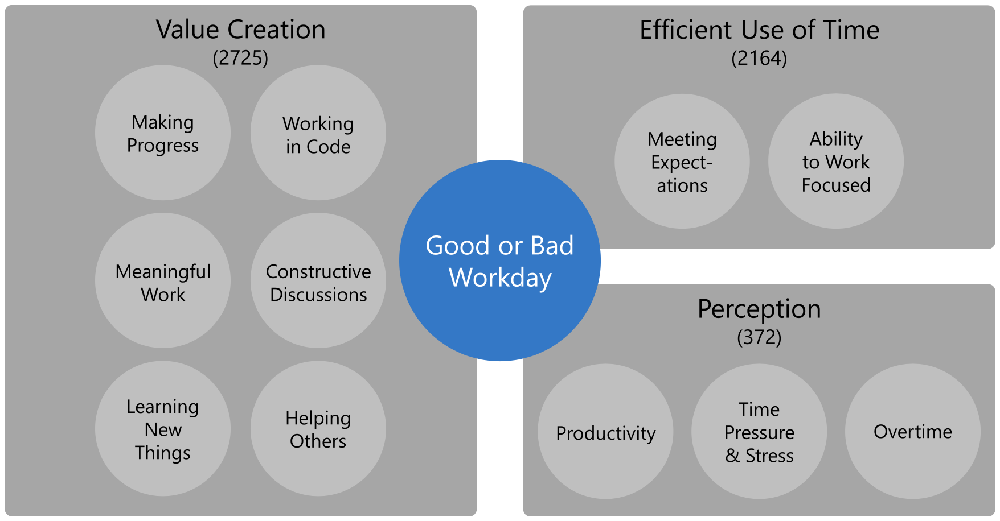
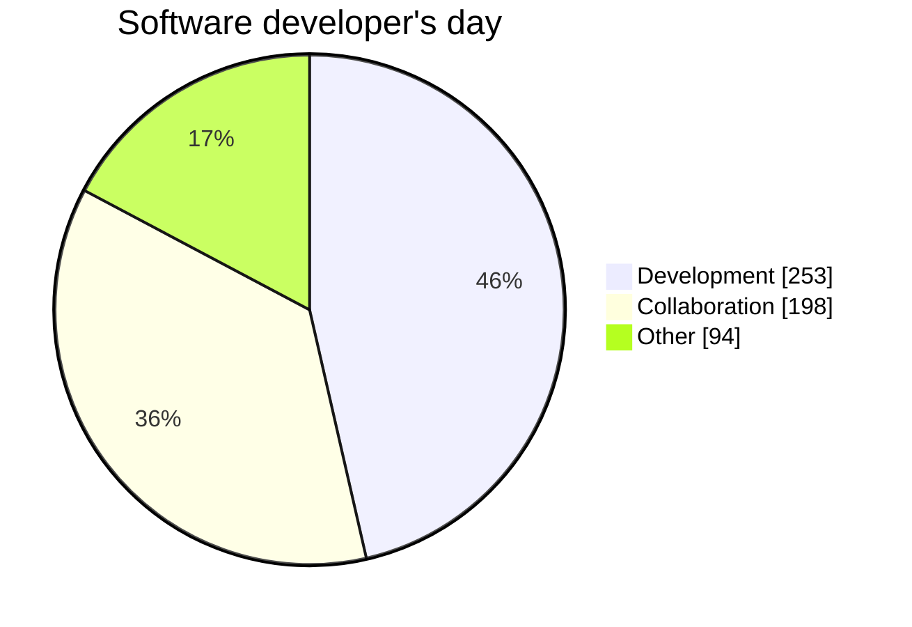
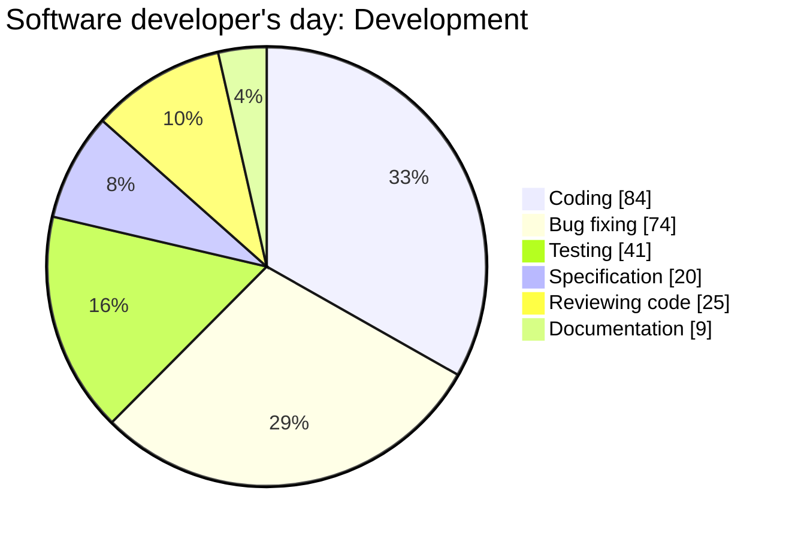
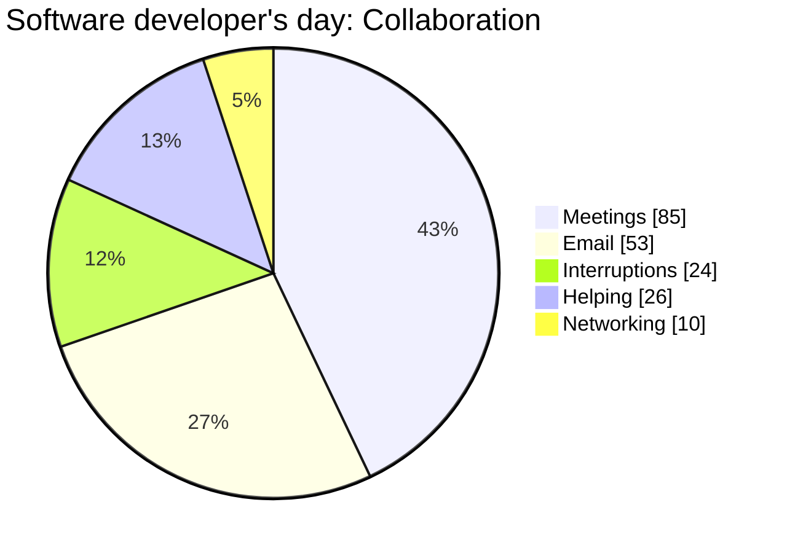
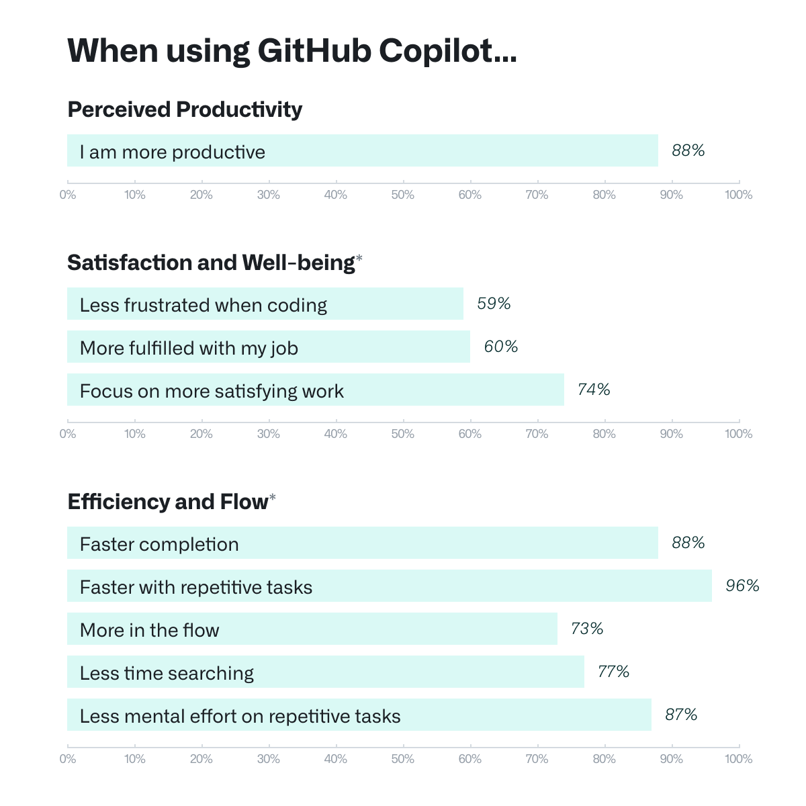
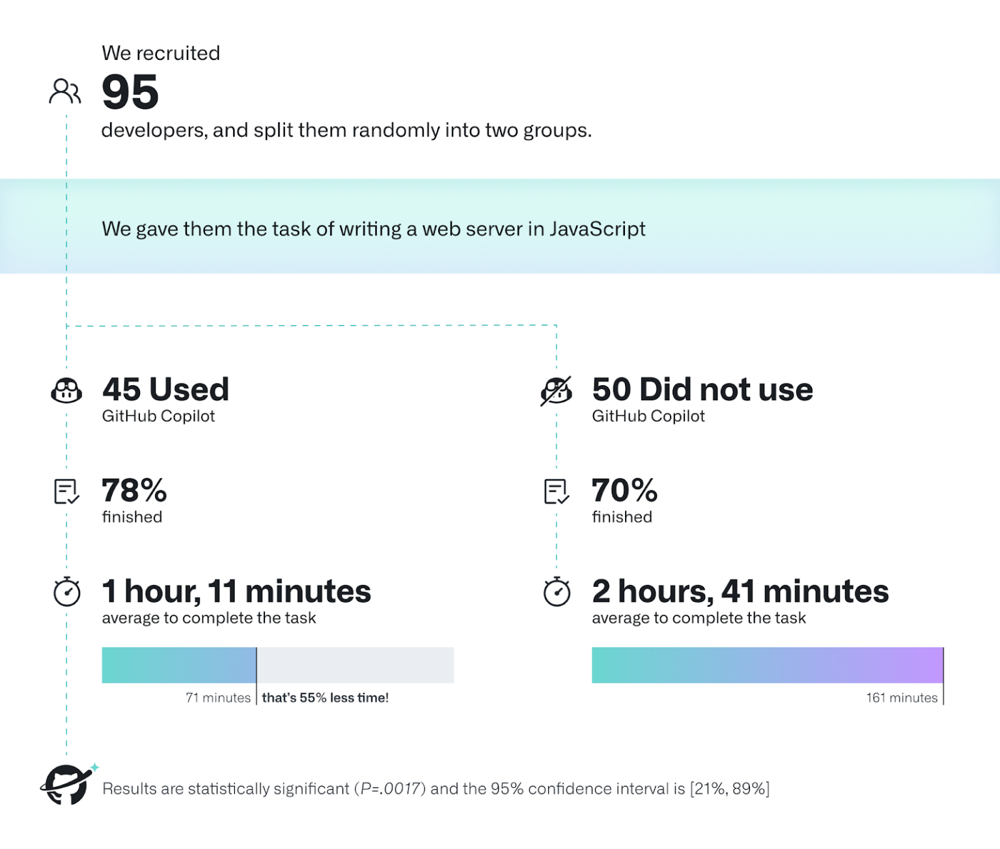
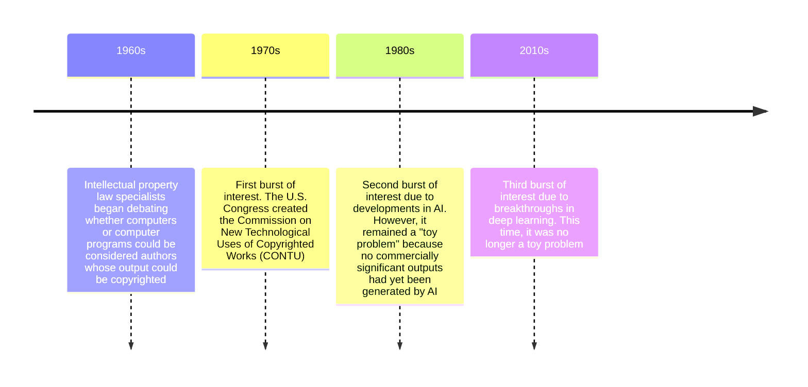

# GitHub Copilot

## Table of contents

- [1. A different way of programming](#1-a-different-way-of-programming)
    - [1.1. AI-assisted programming v. web search](#11-ai-assisted-programming-v-web-search)
    - [1.2. AI-assisted programming v. compilation](#12-ai-assisted-programming-v-compilation)
    - [1.3. AI-assisted programming v. pair programming](#13-ai-assisted-programming-v-pair-programming)
- [2. GitHub Copilot](#2-github-copilot)
    - [2.1. What you get](#21-what-you-get)
        - [2.1.1. Code completions](#211-code-completions)
        - [2.1.2. Chats](#212-chats)
            - [2.1.2.1. Chat participants](#2121-chat-participants)
            - [2.1.2.2. Slash commands](#2122-slash-commands)
            - [2.1.2.3. Chat variables](#2123-chat-variables)
        - [2.1.3. Edits](#213-edits)
        - [2.1.4. Code review](#214-code-review)
        - [2.1.5. Command suggestions and explanations](#215-command-suggestions-and-explanations)
    - [2.2. Tips and tricks](#22-tips-and-tricks)
        - [2.2.1. Context](#221-context)
        - [2.2.2. Chat management](#222-chat-management)
        - [2.2.3. Prompting](#223-prompting)
- [3. Today was a good day](#3-today-was-a-good-day)
- [4. Legally speaking](#4-legally-speaking)
    - [4.1. Who has the right to claim authorship?](#41-who-has-the-right-to-claim-authorship)
    - [4.2. Can in-copyright works be used for training?](#42-can-in-copyright-works-be-used-for-training)
    - [4.3. Does Copilot retain user prompts?](#43-does-copilot-retain-user-prompts)
    - [4.4. Can Copilot users use suggestions without concern?](#44-can-copilot-users-use-suggestions-without-concern)
    - [4.5. Who owns the suggestions provided by Copilot?](#45-who-owns-the-suggestions-provided-by-copilot)
- [Glossary](#glossary)
- [Bibliography](#bibliography)
- [Licenses](#licenses)

## 1. A different way of programming

AI-assisted programming is the practice of using AI tools as collaborators to generate, complete, refactor, test, and explain software code

Some people view AI-assisted programming as
- Web searching (see [§1.1](#11-ai-assisted-programming-v-web-search))
- Compilation (see [§1.2](#12-ai-assisted-programming-v-compilation))
- Pair programming (see [§1.3](#13-ai-assisted-programming-v-pair-programming))

However, these are misconceptions. While some similarities exist, AI-assisted programming is fundamentally different

### 1.1. AI-assisted programming v. web search

| Similarity             | Explanation                                                                                                                                                    |
| ---------------------- | -------------------------------------------------------------------------------------------------------------------------------------------------------------- |
| Starting point         | A prompt or query typically written in natural language that may also contain code snippets                                                                    |
| Information asymmetry  | The programmer does not know what form the result will take                                                                                                    |
| Several results        | The programmer will need to invest time evaluating and comparing them                                                                                          |
| No solution guaranteed | The programmer may only get an inexact solution, or indeed nothing like what they wanted. The user may need to invest time adapting or repairing what they get |

---

When searching the web, programmers encounter not just code, but a variety of types of results, from code snippets to images and videos. Web searching is a mixed media experience

AI-assisted programming is a fixed media experience—the only output is code, comments, and data within the context of the code editor. Although this makes code insertion faster, it comes at a price

As a mixed media experience, web searching makes the programmer learn, explore, and discover from a wide variety of sources. Provenance is also challenging in AI-assisted programming, as it is often difficult to determine whether code generation is original or not

### 1.2. AI-assisted programming v. compilation

Compilation is the process of translating a program written in a language into a program written in another language. Compilers are the programs that perform such a translation

In this view, programming through natural language prompts is a form of higher-level specification that is "compiled" via the model to the source code in the target language. Programming at higher levels of abstraction shifts the focus from the *what* to the *how*. However, the *what* is not easier than the *how*

Higher levels of abstraction do not necessarily require higher-level languages. For example, tests are not typically written in a higher-level language than the code, although they aim to capture a higher-level notion of correctness—the *what* of the problem being solved

---

| Compilation                                                          | AI-assisted programming                                                                                                    |
| -------------------------------------------------------------------- | -------------------------------------------------------------------------------------------------------------------------- |
| Programmer's knowledge of the target language is not a prerequisite  | The programmer must understand and evaluate the generated code to be effective                                             |
| Compilers almost always generate correct code                        | The programmer must always check the generated code for correctness                                                        |
| Compilers are deterministic                                          | LLMs are probabilistic                                                                                                     |
| The input is limited to what can be expressed in the source language | The input is a prompt written in natural language. The range of abstractions expressible in natural language is much wider |

### 1.3. AI-assisted programming v. pair programming

Pair programming is a software development technique in which two programmers work together at one workstation. One, the driver, writes code while the other, the navigator,  reviews each line of code as it is typed in. The two programmers switch roles frequently

In this analogy, the AI assistant takes the role of the driver while the human programmer takes the role of the navigator. However, as already pointed out (see [§1.2](#12-ai-assisted-programming-v-compilation)), the human programmer must still be able to understand the code at the statement level

The human programmer may become lazier, but the experience still involves a lot of statement-level checking

---

Pair programming requires a conscious, negotiated decision to swap roles. There is no such thing in AI-assisted programming, where the human programmer is continuously switching from driving to navigating

However, several studies have shown that some of the benefits of pair programming do not really come from the role division itself. For example, pair programming forces programmers to rationalize their decisions to each other ([Hannay, J. et al.](https://www.sciencedirect.com/science/article/pii/S0950584909000123)) and induces greater focus out of respect for shared time ([Williams, L. and Kessler, R.](https://dl.acm.org/doi/abs/10.1145/332833.332848))

These advantages are largely absent in AI-assisted programming

## 2. GitHub Copilot

GitHub Copilot—a product developed by GitHub and OpenAI—is an AI coding assistant

There are [a few ways](https://github.com/features/copilot/plans) to start using Copilot. [Students](https://github.com/education/students), [teachers](https://github.com/education/teachers), and [open source maintainers](https://docs.github.com/en/copilot/managing-copilot/managing-copilot-as-an-individual-subscriber/getting-started-with-copilot-on-your-personal-account/getting-free-access-to-copilot-pro-as-a-student-teacher-or-maintainer#accessing-copilot-pro-for-free) may qualify for Copilot Pro at **no cost**

Once you have a Copilot plan
- [Set up Copilot in your IDE](https://docs.github.com/en/copilot/managing-copilot/configure-personal-settings/installing-the-github-copilot-extension-in-your-environment)
- [Set up Copilot on the command line](https://docs.github.com/en/copilot/managing-copilot/configure-personal-settings/installing-github-copilot-in-the-cli)

### 2.1. What you get

Some of the features currently available are in public preview (thus subject to change) or limited to specific plans (e.g., Copilot Pro+, Copilot Business, or Copilot Enterprise). For example, there are features specific to administrators but only available with Copilot Business or Copilot Enterprise

The following is limited to a subset of the stable features—those available with Copilot Pro that are not in public preview

Check [this](https://docs.github.com/en/copilot/about-github-copilot/github-copilot-features) out to get the full list of Copilot features

---

| Tool                                                                                           | Use case                                                                                                                             |
| ---------------------------------------------------------------------------------------------- | ------------------------------------------------------------------------------------------------------------------------------------ |
| Code completions (see [§2.1.1](#211-code-completions))                                         | Receive suggestions as you type in the editor                                                                                        |
| Chats (see [§2.1.2](#212-chats))                                                                | Have an ongoing chat conversation for brainstorming design ideas or getting code suggestions                                         |
| Edits (see [§2.1.3](#213-edits))                                                               | Use natural language to start a code editing session. Automatically apply large code changes across multiple files in your workspace |
| Code review (see [§2.1.4](#214-code-review))                                                   | Request a code review or a review of your changes                                                                                    |
| Command suggestions and explanations (see [§2.1.5](#215-command-suggestions-and-explanations)) | Get suggestions and explanations for the command line                                                                                |

#### 2.1.1. Code completions

Code suggestions show up as you type. Inline suggestions autocomplete code. Next edit suggestions assist with edits both at the cursor and in other relevant parts of the code

| Shortcut/action            | Effect                                   |
| -------------------------- | ---------------------------------------- |
| Press `Tab`                | Accept suggestion                        |
| Press `⌘`+`→`              | Accept word                              |
| Press `⌘`+`↓` (no default) | Accept line                              |
| Press `⌥`+`]`              | Next suggestion                          |
| Press `⌥`+`[`              | Previous suggestion                      |
| Press `Ctrl`+`Enter`       | Open new tab with additional suggestions |
| Press `Esc`                | Reject suggestion                        |
| Hover over suggestion      | Display control for choosing suggestions |

#### 2.1.2. Chats

Copilot can answer questions about your projects or general software questions. Copilot can write code, fix errors, write tests, and document code

There are a few ways to chat with Copilot. You can use a chat, a quick chat, or an inline chat. In a prompt you can also include special keywords: chat participants (see [§2.1.2.1](#2121-chat-participants)), slash commands (see [§2.1.2.2](#2122-slash-commands)), and chat variables (see [§2.1.2.3](#2123-chat-variables))

| Shortcut/action       | Effect           |
| --------------------- | ---------------- |
| Press `⌃`+`⌘`+`I`     | Open chat        |
| Press `⇧`+`⌥`+`⌘`+`L` | Open quick chat  |
| Press `⌘`+`I`         | Open inline chat |

##### 2.1.2.1. Chat participants

Chat participants are domain experts who can help you with their specialty. Type `@` to insert a chat participant

| Chat participant | Description                                                                                                                                                                                                          |
| ---------------- | -------------------------------------------------------------------------------------------------------------------------------------------------------------------------------------------------------------------- |
| `@terminal`      | This participant has context about the Visual Studio Code terminal shell and its contents. Use it when you want help creating or debugging terminal commands                                                         |
| `@vscode`        | This participant has context about Visual Studio Code commands and features. Use it when you want help with Visual Studio Code                                                                                       |
| `@workspace`     | This participant has context about the code in your workspace. Use it when you want Copilot to consider the structure of your project, how different parts of your code interact, or design patterns in your project |

##### 2.1.2.2. Slash commands

Slash commands are shortcuts for prompts used in common scenarios. Type `/` to insert a slash command

| Slash command | Description                                        |
| ------------- | -------------------------------------------------- |
| `/clear`      | Start a new chat session                           |
| `/explain`    | Explain how the code in your active editor works   |
| `/fix`        | Propose a fix for problems in the selected code    |
| `/help`       | Quick reference and basics of using GitHub Copilot |
| `/new`        | Create new project                                 |
| `/tests`      | Generate unit tests for the selected code          |

##### 2.1.2.3. Chat variables

Chat variables include specific context in your prompt. Type `#` to insert a chat variable

| Chat variable | Description                                       |
| ------------- | ------------------------------------------------- |
| `#selection`  | Include the currently selected text in the prompt |
| `#<file>`     | Include the `file`'s content in the prompt        |
| `#<class>`    | Include the `class`'s content in the prompt       |
| `#<function>` | Include the `function`'s content in the prompt    |
| `#codebase`   | Include the project codebase                      |
| `#changes`    | Include recent changes                            |

#### 2.1.3. Edits

In addition to the traditional ask mode, Copilot can also work in edit and agent modes. You can switch modes in the chat (dropdown menu at the bottom)

In edit mode, you can prompt Copilot to make edits across multiple files. This mode is particularly useful when you have a good understanding of the changes that you want to make and which files you want to edit

In agent mode, you can prompt Copilot to specify a high-level task, and let Copilot autonomously reason about it, plan the work, and apply the changes. This mode is particularly useful when you have a less well-defined task that might also require terminal commands and tools

#### 2.1.4. Code review

Copilot provides reviews in two ways: review selection and review changes

Review selection works as follows. Select code and ask for an initial review. There is no default shortcut, so open command palette (press `⇧`+`⌘`+`P`), start typing "review and comment", and select "GitHub Copilot: Review and Comment"

Review changes is about reviewing staged or unstaged changes. There is a code review button in the source control section of VS Code

#### 2.1.5. Command suggestions and explanations

To ask Copilot to explain a command

```shell
$ gh copilot explain "command"
```

To ask Copilot to suggest a command

```shell
$ gh copilot suggest "task to do"
```

### 2.2. Tips and tricks

[Using GitHub Copilot in your IDE: Tips, tricks, and best practices](https://github.blog/developer-skills/github/how-to-use-github-copilot-in-your-ide-tips-tricks-and-best-practices/)

#### 2.2.1. Context

Copilot is implemented as a client-server application. The client runs as an extension within your code editor. The server communicates with OpenAI's backend models hosted in the cloud

Every now and then, the client generates a prompt and sends it to the server to receive code suggestions. This prompt is crafted based on the content of the current file (what you are working on), the cursor position (where you are working), and the contents of neighboring tabs (potentially related context)

As a rule of thumb, the more contextually rich the prompt is, the better the output will be. The other way around: garbage in, garbage out

[How GitHub Copilot is getting better at understanding your code](https://github.blog/ai-and-ml/github-copilot/how-github-copilot-is-getting-better-at-understanding-your-code/#how-github-copilot-understands-your-code)

---

> [!tip] Tip 1: Open relevant files
> Copilot uses the content of your open files as context to build a prompt, sends it to the server, and returns a relevant suggestion

> [!tip] Tip 2: Provide a top-level comment
> A short, high-level introduction at the top of the file gives Copilot a goal to work toward

> [!tip] Tip 3: Set dependencies
> You know what dependencies you want to use. Set them manually to help Copilot craft suggestions accordingly

---

> [!tip] Tip 4: Give meaningful names and provide function comments
> The names you give to variables and functions matter. Function comments also help

> [!tip] Tip 5: Give examples
> Sample code helps Copilot understand what you're looking for (see [few-shot prompting](prompt-engineering.md#32-few-shot-prompting)). Yes, tests count as examples

> [!tip] Tip 6: Design top-down, implement bottom-up
> Break down the problem first. Start with low-level functions—Copilot can use them as building blocks when suggesting higher-level code

#### 2.2.2. Chat management

| Chat        | Use case                                                                                                             |
| ----------- | -------------------------------------------------------------------------------------------------------------------- |
| Inline chat | Quick fix. Select the code snippet you want to work on and press `⌘`+`I`. Suggestions are shown inline as code diffs |
| Quick chat  | Ask a quick question (press `⇧`+`⌥`+`⌘`+`L`) and get back into what you were doing (press `Esc`)                     |
| Chat        | Ongoing conversations. Press `⌃`+`⌘`+`I` to open the chat panel and the same combination again to hide it            |

---

> [!tip] Tip 7: Keep history relevant
> You can remove previous requests to give Copilot only the necessary information

> [!tip] Tip 8: Navigate through your conversations
> Use the up and down arrow keys to navigate through your request history, just like you would in a terminal

> [!tip] Tip 9: Use keywords
> Type `@` for chat participants (domain experts), `/` for slash commands (prompt shortcuts), and `#` for chat variables (context) 

---

> [!tip] Tip 10: Highlight relevant code
> Highlighting relevant code before prompting helps Copilot provide more targeted suggestions

> [!tip] Tip 11: Organize conversations in threads
> You can have multiple ongoing conversations, each in a different thread (press the `+` button in the top-right corner of the chat)

> [!tip] Tip 12: Debug faster
> Use the chat to ask for help (`/explain` and `/fix`)—debugging is often faster here than searching through external resources

#### 2.2.3. Prompting

> [!tip] Tip 13: Start general, then get specific
> When writing a prompt, first give a broad description of the goal and then list any specific requirements

> [!tip] Tip 14: Break complex tasks into simpler tasks
> If you want Copilot to complete a complex or large task, break the task into multiple simple, small tasks (see [decomposed prompting](prompt-engineering.md#34-decomposed-prompting))

> [!tip] Tip 15: Be flexible
> If you do not get the result you want, iterate on your prompt and try again (see [prompting](prompt-engineering.md#3-prompting-techniques) and [prompt engineering](prompt-engineering.md#4-prompt-engineering-techniques) techniques)

## 3. Today was a good day

Satisfied developers are more productive and write better code. Good workdays increase job satisfaction. Understanding what differentiates good workdays from other days, especially atypical days, will help make good days typical

[Meyer, A. et al.](https://ieeexplore.ieee.org/document/8666786) conducted a large-scale survey at Microsoft to answer two questions
1. What is a good day for a software developer?
2. What is a typical workday?

They collected 5,971 responses from professional developers who reflected on these questions and self-reported how they spent their time on various activities at work

---



---

Developers spend more time figuring out what they need to code than actually coding



---

Development activities require developers to focus for long chunks of time without interruptions. The longest period developers could work on code without an interruption was 47.3 minutes on average



---

While conventional wisdom holds that email is a major issue, it has little impact on how good a workday feels. Developers see interruptions and meetings as the main barriers to productive coding



---

[Ziegler, A. et al.](https://dl.acm.org/doi/10.1145/3520312.3534864) surveyed 2,631 responses from developers that signed up for the technical preview of GitHub Copilot



[Research: quantifying GitHub Copilot’s impact on developer productivity and happiness](https://github.blog/news-insights/research/research-quantifying-github-copilots-impact-on-developer-productivity-and-happiness/)

---



[Research: quantifying GitHub Copilot’s impact on developer productivity and happiness](https://github.blog/news-insights/research/research-quantifying-github-copilots-impact-on-developer-productivity-and-happiness/)

## 4. Legally speaking

Samuelson, P. is the Richard M. Sherman Distinguished Professor of Law and Information at the University of California, Berkeley

She is the author of Legally Speaking, an opinion column published by the [Communications of the ACM](https://cacm.acm.org/)

Over the last few years, she has written [AI authorship](https://dl.acm.org/doi/10.1145/3401718), [Text and Data Mining of In-Copyright Works: Is It Legal?](https://dl.acm.org/doi/10.1145/3486628), [Legal Challenges to Generative AI, Part I](https://dl.acm.org/doi/10.1145/3597151), and [Legal Challenges to Generative AI, Part II](https://dl.acm.org/doi/10.1145/3625251), just to name a few

### 4.1. Who has the right to claim authorship?



---


[The Next Rembrandt](https://news.microsoft.com/europe/features/next-rembrandt/)

---

> [!example] *Cummins v. Bond* (United Kingdom, 1927)
> **Claim**:  Cummins, a medium, claimed she was the author of the Chronicle of Cleophas, received via automatic writing. She sued Bond, who edited and published parts of the work, for copyright infringement. In Bond’s view, if the spirit was the author, then no human author could claim copyright
> 
> **Verdict**: The court ruled that Cummins was the sole legal author. Regardless of the spirit’s alleged contribution, only living humans can hold copyright, and Bond’s editorial work did not qualify for joint authorship

---


[Monkey selfie copyright dispute](https://en.wikipedia.org/wiki/Monkey_selfie_copyright_dispute)

---

> [!example] *Slater v. Wikimedia* (United States, 2014)
> **Claim**: Photographer David Slater claimed copyright over the "monkey selfie," arguing he created the conditions for the photo—traveling to Indonesia, befriending macaques, and setting up the camera for them to use. Wikimedia Commons hosted the image, arguing it lacked a human author
> 
> **Verdict**: The U.S. Copyright Office stated that works without human authorship—such as photos taken by animals—are not eligible for copyright protection

---

> [!example] *Naruto v. Slater* (United States, 2018)
> **Claim**: The People for the Ethical Treatment of Animals (PETA) argued that they were Naruto's guardian and therefore entitled to claim copyright in the photos on Naruto's behalf
> 
> **Verdict**: The court dismissed the case, holding that 
> 1. PETA lacked standing to represent the monkey, and
> 2. Animals cannot hold copyright under U.S. law

---

> \[There is\] no reasonable basis for considering that a computer in any way contributes authorship to a work produced through its use
> 
> -- The CONTU report (1979)

CONTU regarded computers and computer programs as tools with which works could be created much like cameras enable the creation of copyrightable photographs 

> Only works created by a human can be copyrighted under United States law, which excludes photographs and artwork created by animals or by machines without human intervention
> 
> -- The U.S. Copyright Office

### 4.2. Can in-copyright works be used for training?

> [!example] *Doe v. GitHub* (United States, in progress)
> **Claim**: J. Doe 1, 2, 3, and 4 sued GitHub, OpenAI, and Microsoft for USD 9 billion in damages
> 
> The Does' most significant claims are
> 1. Copyright was removed from the open source code ingested for training
> 2. License agreements have been breached. No attribution to developers whose code was used for training. No copyright notices in reused code

J. Doe 1, 2, 3, and 4 are fake names for unknown programmers 

---

About *Doe v. GitHub*'s claim (1)

> [!example] *Stevens v. Corelogic* (United States, 2018)
> **Claim**: Stevens, a photographer, posted images with copyright metadata. The hosting platforms used Corelogic's software to display images. This software removed such metadata for faster loading. Stevens sued Corelogic for not preserving copyright metadata
> 
> **Verdict**: The court ruled in Corelogic’s favor because Stevens did not show that
> 1. Corelogic intentionally removed the copyright, nor
> 2. The removal facilitated copyright infringement

---

About *Doe v. GitHub*'s claim (2)

GitHub requires all of its users to agree to its terms of service

> \[GitHub has the right to\] store, archive, parse, and display \[...\] and make incidental copies \[of the users' code, as well as to\] parse it into a search index or otherwise analyze it \[and\] share \[the resulting code in public repositories with other users\]
> 
> -- GitHub's terms of service

Simply put, no matter what license you use, you give GitHub the right to host your code and use it to improve their services

---

But why not copyright infringement?

> [!example] *Authors Guild v. Google* (United States, 2015)
> **Claim**: Google copied millions of in-copyright books and scanned them for indexing purposes. Authors Guild brought a class action lawsuit charging Google with copyright infringement for making these digital copies
> 
> **Verdict**: The court ruled in Google’s favor because
> 1. While Google copied the whole of each book, this was necessary to achieve its transformative purpose of indexing book contents for analysis and search
> 2. Because Google displayed only up to three short snippets from each book, those snippets were unlikely to undercut the books' market

---

Under the *Authors Guild v. Google* decision, ingesting publicly available source code would seem to be as fair as the scanning of books to index their contents

The snippets of code that Copilot provides in response to user prompts is analogous to the snippets of text from books that Google provides in response to user search queries

Because the court found both the scans and the snippets to be fair uses, GitHub and OpenAI would seem to have plausible fair use defenses

### 4.3. Does Copilot retain user prompts?

Copilot provides suggestions based on the context of what you are working on in your code editor. This requires temporarily transferring an ephemeral copy of various elements of that context to GitHub's servers

The transmitted data is encrypted, both in transit and at rest

Prompts are transmitted in real-time only to return suggestions. If you are using the Copilot extension in the code editor, your prompt, suggestion, and supporting context will be discarded. If you are using Copilot outside the code editor, your prompt, suggestion, and supporting context will be stored for 28 days

### 4.4. Can Copilot users use suggestions without concern?

Copilot does not copy and paste any code. Copilot may be trained on public code, but it does not contain any code. Copilot generates suggestions using probabilistic determination

In rare instances (less than 1% based on GitHub's research), suggestions from Copilot may match examples of code used for training

If a code suggestion matches existing code, there is risk that using that suggestion could trigger claims of copyright infringement. In many ways, this is the same risk that arises when using any code that a developer does not originate, such as copying code from an online source, or reusing code from a library

---

Copilot does include an optional duplicate detection filter to detect and suppress certain suggestions that match public code on GitHub. If there is a match, the suggestion will not be shown

If you use Copilot and turn on the code filtering feature, then GitHub will take responsibility—not you—for any copyright issues that arise from unmodified code suggestions Copilot provides

Copilot also includes a code-referencing feature to assist users in finding and reviewing potentially relevant open source licenses. When a match is located, Copilot provides an alert that includes links to repositories for any such matching code, along with any available information on applicable software licenses

### 4.5. Who owns the suggestions provided by Copilot?

Whether a suggestion generated by an AI model can be owned depends on many factors (e.g., the intellectual property law in the relevant country or the length of the suggestion)

GitHub does not determine whether a suggestion is capable of being owned

GitHub does not claim ownership of a suggestion

## Glossary

| Term                                | Meaning                                                                                                                                                                                                                                                                                     |
| ----------------------------------- | ------------------------------------------------------------------------------------------------------------------------------------------------------------------------------------------------------------------------------------------------------------------------------------------- |
| AI-assisted programming (or coding) | The practice of using AI tools as collaborators to generate, complete, refactor, test, and explain software code                                                                                                                                                                            |
| Artificial intelligence (AI)        | The capability of computational systems to perform tasks typically associated with human intelligence, such as learning, reasoning, problem-solving, perception, and decision-making                                                                                                        |
| Chat participant                    | A keyword preceded by `@` used to include a domain expert in the conversation                                                                                                                                                                                                               |
| Chat variable                       | A keyword preceded by `#` used to include relevant context                                                                                                                                                                                                                                  |
| Code review                         | A software quality assurance activity in which one or more people examine the source code of a computer program, either after implementation or during the development process                                                                                                              |
| Commit                              | A snapshot of the project at a specific point in time                                                                                                                                                                                                                                       |
| Compilation                         | The process of translating a program written in a language into a program written in another language                                                                                                                                                                                       |
| Compiler                            | A program that translates one language (source language) into another (object language)                                                                                                                                                                                                     |
| Computer programming (or coding)    | Computer programming or coding is the composition of sequences of instructions, called programs, that computers can follow to perform tasks                                                                                                                                                 |
| Copyright                           | A type of intellectual property that gives its owner the exclusive legal right to copy, distribute, adapt, display, and perform a creative work, usually for a limited time                                                                                                                 |
| Driver                              | In the context of pair programming, the programmer who writes code                                                                                                                                                                                                                          |
| GitHub Copilot                      | An AI-assisted programming tool                                                                                                                                                                                                                                                             |
| In-copyright work                   | Any creative work that is still protected by copyright law                                                                                                                                                                                                                                  |
| Large language model (LLM)          | An AI model that has been trained on large amounts of data and is able to generate text in a human-like fashion                                                                                                                                                                             |
| Navigator                           | In the context of pair programming, the programmer who reviews the code written by the driver                                                                                                                                                                                               |
| Pair programming                    | A software development technique in which two programmers—a driver and a navigator—work together at one workstation. The two programmers switch roles frequently                                                                                                                            |
| Slash command                       | A keyword preceded by `/` used as a shortcut for common prompts                                                                                                                                                                                                                             |
| Staged change                       | A change to a file in the working directory that has already been marked to be included in the next commit                                                                                                                                                                                  |
| Test automation                     | The use of software separate from the software being tested to control the execution of tests and the comparison of actual outcomes with predicted outcomes                                                                                                                                 |
| Test case                           | A specification of the inputs, execution conditions, testing procedure, and expected results that define a single test to be executed to achieve a particular software testing objective, such as to exercise a particular program path or to verify compliance with a specific requirement |
| Test-driven development (TDD)       | A way of writing code that involves writing an automated unit-level test case that fails, then writing just enough code to make the test pass, then refactoring both the test code and the production code, then repeating with another new test case                                       |
| Unit testing                        | A form of software testing by which isolated source code is tested to validate expected behavior                                                                                                                                                                                            |
| Unstaged change                     | A change to a file in the working directory that has not yet been marked to be included in the next commit                                                                                                                                                                                  |

## Bibliography

| Author            | Title                                                                                        | Year |
| ----------------- | -------------------------------------------------------------------------------------------- | ---- |
| Community         | [Wikipedia](https://en.wikipedia.org/)                                                       | 2025 |
| GitHub            | [GitHub Copilot Documentation](https://docs.github.com/en/copilot)                           | 2025 |
| GitHub            | [GitHub Copilot Trust Center](https://copilot.github.trust.page/)                            | 2025 |
| Sarkar, A. et al. | [What Is It Like to Program with Artificial Intelligence?](https://arxiv.org/abs/2208.06213) | 2022 |

## Licenses

| Content | License                                                                                                                       |
| ------- | ----------------------------------------------------------------------------------------------------------------------------- |
| Code    | [MIT License](https://mit-license.org/)                                                                                       |
| Text    | [Creative Commons Attribution-NonCommercial-ShareAlike 4.0 International](https://creativecommons.org/licenses/by-nc-sa/4.0/) |

