# Large language models for software engineering

## Table of contents

- [1. Large language models](#1-large-language-models)
    - [1.1. What an LLM looks like](#11-what-an-llm-looks-like)
    - [1.2. Getting the parameters](#12-getting-the-parameters)
        - [1.2.1. Pre-training](#121-pre-training)
        - [1.2.2. Objective function](#122-objective-function)
        - [1.2.3. Fine-tuning](#123-fine-tuning)
        - [1.2.4. Costs](#124-costs)
    - [1.3. Scaling hypothesis](#13-scaling-hypothesis)
    - [1.4. What could possibly go wrong](#14-what-could-possibly-go-wrong)
        - [1.4.1. Hallucinations](#141-hallucinations)
            - [1.4.1.1. Factual contradictions](#1411-factual-contradictions)
            - [1.4.1.2. Factual fabrications](#1412-factual-fabrications)
            - [1.4.1.3. Instruction inconsistencies](#1413-instruction-inconsistencies)
            - [1.4.1.4. Context inconsistencies](#1414-context-inconsistencies)
            - [1.4.1.5. Logical inconsistencies](#1415-logical-inconsistencies)
        - [1.4.2. Determinism v. non-determinism](#142-determinism-v-non-determinism)
- [2. Software engineering](#2-software-engineering)
    - [2.1. Requirements engineering](#21-requirements-engineering)
    - [2.2. Software development](#22-software-development)
        - [2.2.1. Code generation and completion](#221-code-generation-and-completion)
    - [2.3. Software quality assurance](#23-software-quality-assurance)
        - [2.3.1. Software testing](#231-software-testing)
    - [2.4. Maintenance](#24-maintenance)
        - [2.4.1. Debugging and automated program repair](#241-debugging-and-automated-program-repair)
        - [2.4.2. Performance improvement](#242-performance-improvement)
        - [2.4.3. Refactoring](#243-refactoring)
- [Glossary](#glossary)
- [Bibliography](#bibliography)
- [Licenses](#licenses)

## 1. Large language models

### 1.1. What an LLM looks like

An LLM is an AI model that has been trained on large amounts of data and is able to generate text in a human-like fashion. For example, `llama-2-70b` has 70 billion parameters. Each parameter is a 16-bit floating-point value, thus `parameters` is around 140GB. This is what `llama-2-70b` looks like on the filesystem.

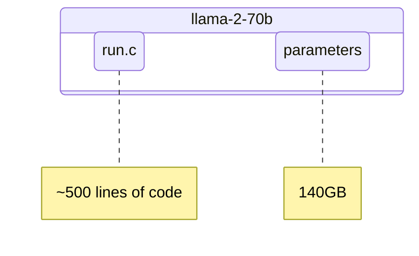

### 1.2. Getting the parameters

#### 1.2.1. Pre-training

Computational complexity is not in running the model, but rather in getting the parameters. Think of it as compressing the Internet.

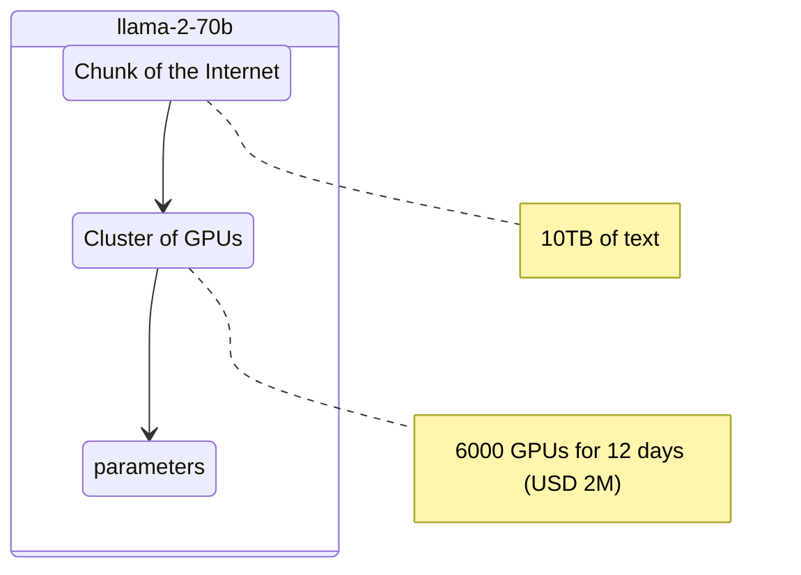

`parameters` is like a `.zip` file. 10TB of text is zipped into 140GB of `parameters`—a 100x compression. But a caveat on the `.zip` file analogy: compression is lossy.

#### 1.2.2. Objective function

Fundamentally, the objective of an LLM is to predict the next token in a sequence. The next-token prediction is a simple but powerful objective that forces to learn a lot about the world. This knowledge is compressed into `parameters`.

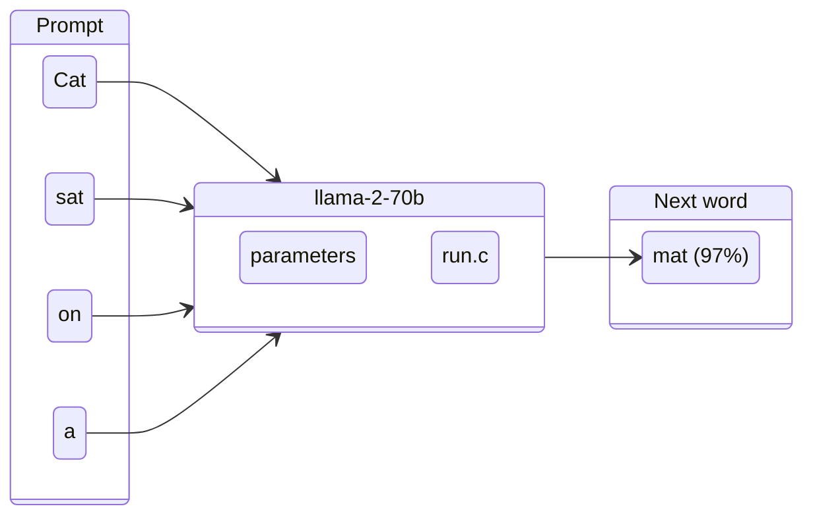

#### 1.2.3. Fine-tuning

The result of pre-training (see [§1.2.1](#121-pre-training)) is something like a document generator. Pre-training is just the first stage of training.

The second stage of training is fine-tuning, which turns the document generator into an assistant. Fine-tuning maintains the same objective function as pre-training (see [§1.2.2](#122-objective-function)), but with a different data set.

The data set used for fine-tuning is a set of manually-collected conversations written by people specifically hired for this purpose. A conversation is a document that follows a question-and-answer style.

---

| Stage        | Quantity                  | Quality | Outcome            |
| ------------ | ------------------------- | ------- | ------------------ |
| Pre-training | Chunk of the Internet     | Low     | Document generator |
| Fine-tuning  | Hundreds of conversations | High    | Assistant          |

After fine-tuning, the LLM switches to a question-and-answer mode. Remarkably, not only can it answer questions about information learned during fine-tuning, but it can also access the knowledge it accumulated during pre-training.

As a rule of thumb, pre-training gathers knowledge, while fine-tuning shapes that knowledge into the desired style.

#### 1.2.4. Costs

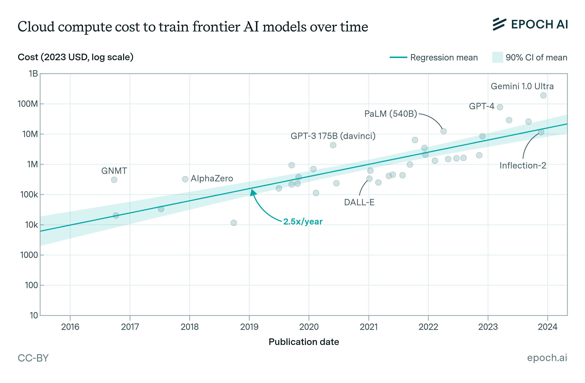

[How much does it cost to train frontier AI models?](http://epoch.ai/blog/how-much-does-it-cost-to-train-frontier-ai-models)

---

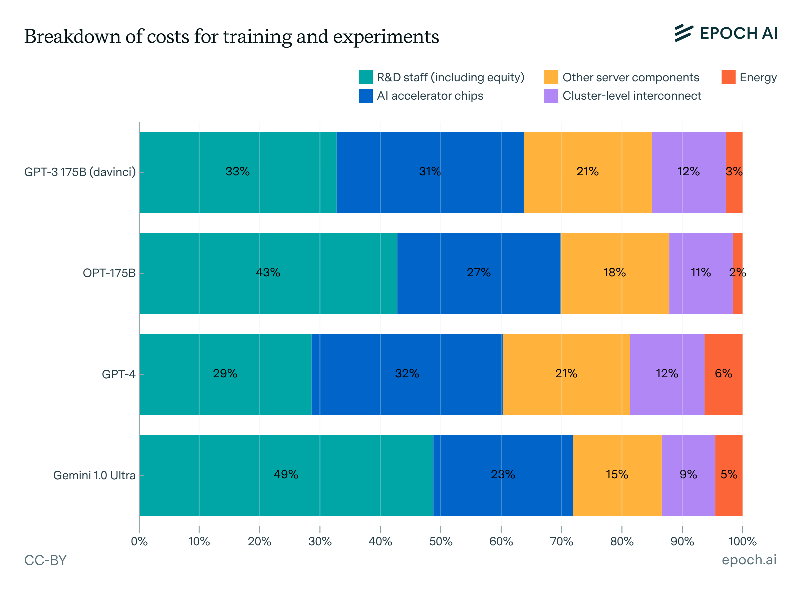

[How much does it cost to train frontier AI models?](http://epoch.ai/blog/how-much-does-it-cost-to-train-frontier-ai-models)

### 1.3. Scaling hypothesis

> General methods that leverage computation are ultimately the most effective, and by a large margin. The ultimate reason for this is Moore's law (the bitter lesson).
> 
> -- [Sutton, R.](https://heartyhaven.github.io/files/bitter_lesson.pdf)

> Model performance depends most strongly on scale, which consists of three factors: the number of model parameters, the size of the dataset, and the amount of compute. Performance has a power-law relationship with each of the three scale factors, when no bottlenecked by the other two.
> 
> -- [Kaplan, J. et al.](https://arxiv.org/pdf/2001.08361)

---

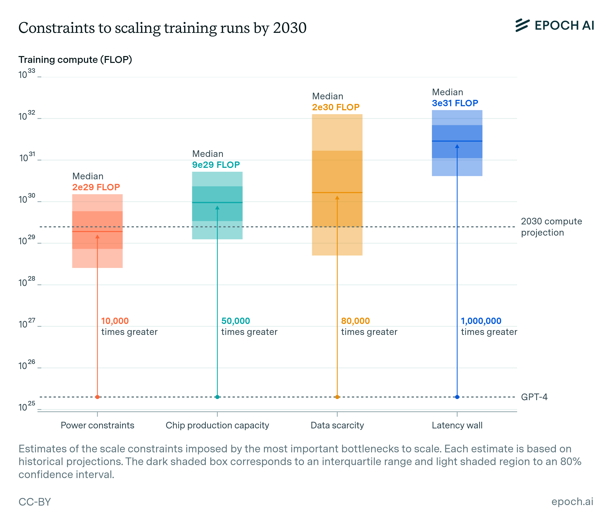

[Can AI scaling continue through 2030?](https://epoch.ai/blog/can-ai-scaling-continue-through-2030)

### 1.4. What could possibly go wrong

Since LLMs are very good at figuring out which word statistically follows another, the answers they give often **sound** authoritative. However, LLMs hallucinate quite often (see [§1.4.1](#141-hallucinations)).

Determinism often shows up in day-to-day programming. For example:

```python
def add(a: int, b: int) -> int:
    return a + b
```

However, LLMs are probabilistic. In other words, same inputs may produce different outputs. This phenomenon is called non-determinism (see [§1.4.2](#142-determinism-v-non-determinism)).

#### 1.4.1. Hallucinations

> A hallucination is an experience involving the apparent perception of something not present.
> 
> -- Oxford English Dictionary

[Maynez, J. et al.](https://aclanthology.org/2020.acl-main.173/) investigated hallucinations in the context of abstractive summarizers, which may hallucinate by either misrepresenting information of the input document (intrinsic hallucination) or adding information not directly inferable from the input document (extrinsic hallucination).

There is no consensus if the summary should be faithful (i.e., without any hallucinations) to the input document or if there is tolerance for some hallucinations (e.g., information not found in the input document but factually correct).

---

[Huang, L. et al.](https://dl.acm.org/doi/10.1145/3703155) proposed a taxonomy for hallucinations affecting LLMs:

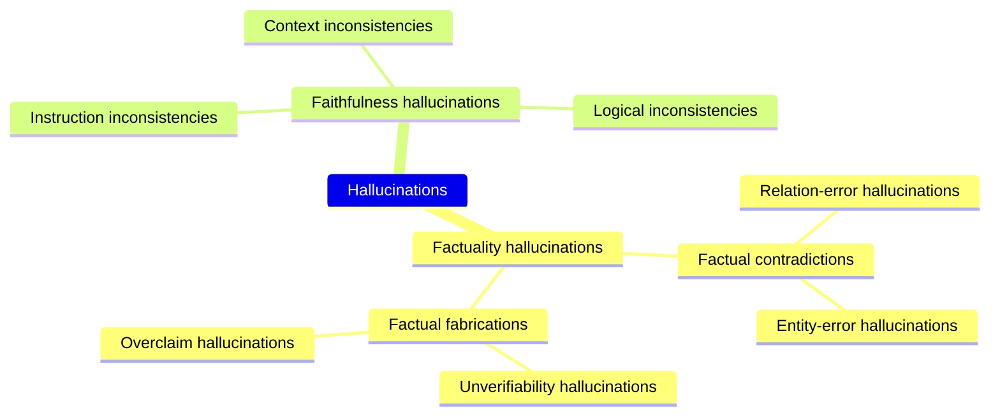

##### 1.4.1.1. Factual contradictions

> [!question] Prompt
> What are Thomas Edison's main contributions to science and technology?

> [!note] Output
Thomas Edison developed the first practical telephone and invented the light bulb.

> [!bug] Explanation
> Edison improved the light bulb (relation-error hallucination), building on earlier designs by others, and Alexander Graham Bell invented the telephone (entity-error hallucination).

##### 1.4.1.2. Factual fabrications

> [!question] Prompt
> What are the major environmental impacts of the construction of the Eiffel Tower?

> [!note] Output
> The construction of the Eiffel Tower in 1889 led to the extinction of the Parisian tiger, a species that played a crucial role in the region's ecosystem. Additionally, it is widely recognized as the event that sparked the global green architecture movement.

> [!bug] Explanation
> There is no evidence of a "Parisian tiger" ever existing (unverifiability hallucination), and attributing the origins of green architecture to the Eiffel Tower is an exaggeration, as this movement has diverse roots and cannot be traced back to a single event (overclaim hallucination).

##### 1.4.1.3. Instruction inconsistencies

> [!question] Prompt
> Translate the English question into Spanish: "What is the capital of France?"

> [!note] Output
> The capital of France is Paris.

> [!bug] Explanation
> Paris is the capital of France, but the request was to translate the question not to answer it.

##### 1.4.1.4. Context inconsistencies

> [!question] Prompt
> Summarize what follows: The Nile is a major north-flowing river in northeastern Africa. It's traditionally considered the longest river in the world. Originating in the Great Lakes region of central Africa, it flows through several countries before emptying into the Mediterranean Sea.
> 

> [!note] Output
> The Nile originates from the mountain ranges of central Africa and flows into the Mediterranean.

> [!bug] Explanation
> The summary incorrectly states that the Nile originates from the "mountain ranges of central Africa," while the paragraph mentioned that the Nile originates in the Great Lakes region of central Africa.
##### 1.4.1.5. Logical inconsistencies

> [!question] Prompt
> Solve the equation $2x + 3 = 11$ step by step.

> [!note] Output
> Step 1: Subtract 3 from both sides to get: 2x = 8. 
> Step 2: Divide both sides by 2 to get: x = 3. 
> So the result of the equation is x = 3.

> [!bug] Explanation
> The first step correctly isolates the term with $x$ to get $2x = 8$. However, the next step inaccurately divides 8 by 2 to yield a result of $x = 3$, which is inconsistent with the earlier reasoning.

#### 1.4.2. Determinism v. non-determinism

> A model is deterministic if it is not possible for it to react in two or more ways to the same inputs.
> 
> -- [Lee, E.](https://dl.acm.org/doi/10.1145/3453652)

Society heavily relies on deterministic models. The underlying physical realization is almost certainly not deterministic but sufficiently faithful to the deterministic model.

Most programming languages (except for concurrency) and the TCP/IP stack (in the sense that a stream of bits in yields the same stream of bits out, even though packets may be dropped or arrive out of order) are examples of deterministic models.

---

There are many reasons why determinism is valuable.

| Reason                | Meaning                                                                                                                         |
| --------------------- | ------------------------------------------------------------------------------------------------------------------------------- |
| Repeatability         | The behavior is repeatable given the same inputs                                                                                |
| Consensus             | Given the same input information, different agents will produce the same results                                                |
| Predictability        | If behaviors in response to certain inputs are predictable, then they do not need to be discovered again                        |
| Fault detection       | Any behavior that deviates from the correct behavior is<br>faulty behavior, meaning that some assumption has not been satisfied |
| Simplicity            | One input implies one behavior                                                                                                  |
| Unsurprising behavior | Often, we want engineered systems to be boring                                                                                  |
| Composability         | A clear understanding of the possible behaviors makes it easier to build larger systems                                         |

---

However, there are cases where we do not really care about determinism. Consider the serverless model. This model has many acceptable behaviors in response to a given input. In other words, it is irrelevant to correctness in what order and where these server functions are executed.

And also we don't always want engineered systems to be boring. Non-deterministic models are fit for purpose here, as they are by definition unpredictable. For example, any AI attempting to exhibit human-like behavior needs to be surprising, and, therefore, at least appear to be non-deterministic.

LLMs are non-deterministic, so forget about repeatability, predictability, fault detection, simplicity, unsurprising behavior, and composability.

## 2. Software engineering

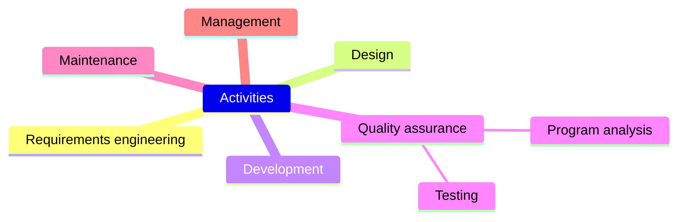

---

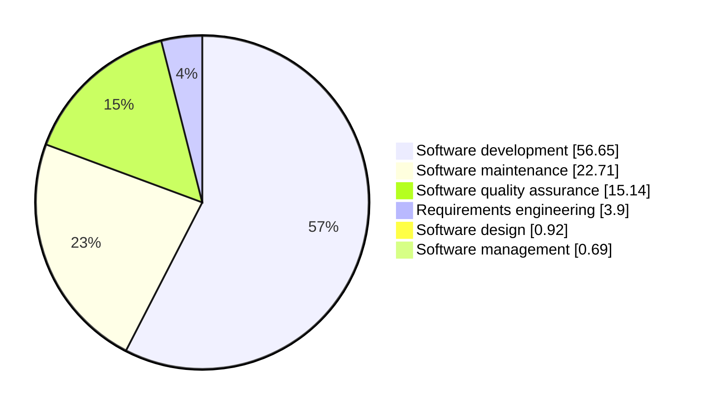

[Large language models for software engineering: A systematic literature review](https://dl.acm.org/doi/10.1145/3695988)

### 2.1. Requirements engineering

The primary measure of success of a software system is the degree to which it meets the purpose for which it was intended.

>Requirements engineering is the process of discovering the purpose for which a software system was intended, by identifying stakeholders and their needs, and documenting these in a form that is amenable to analysis, communication, and subsequent implementation.
> 
> -- [Nuseibeh, B. and Easterbrook, S.](https://dl.acm.org/doi/10.1145/336512.336523)

Whether requirements engineering is a branch of software engineering or systems engineering depends on the definition (e.g., [Zave, P.](https://dl.acm.org/doi/10.1145/267580.267581)).

---

Only a few works have explored LLMs for requirements engineering. However
- Requirements engineering has a long tradition of thinking about and coming up with methods to describe stakeholder needs precisely;
- LLMs have natural language processing capabilities.

> Requirements traceability is the ability to describe and follow the life of a requirement, in both a forwards and backwards direction.
> 
> -- [Gotel, O. and Finkelstein, A.](https://ieeexplore.ieee.org/document/292398)

Identifying traceability links between requirements and other engineering artefacts, such as code and tests, is especially challenging because written in natural language—a natural fit for LLMs.

### 2.2. Software development 

#### 2.2.1. Code generation and completion

Code completion is the area of software engineering where LLMs have been most thoroughly explored so far.

To some extent, code completion sidesteps hallucination problems by acting as a recommender system to the developer, who is ultimately responsible to weed out hallucinations before integrating the generated content into the code base. Many software engineers already appear to have decided that the benefits outweigh any necessary human filtration effort.

There are expectations that programmers will spend more time reviewing rather than writing code.

---

Naturalness is about how a language is actually used in daily tasks. Although English can accommodate arbitrarily complex expressions, everyday human communication is often simple, expedient, and even repetitive.

Programming is as much an act of communication, from one human to another, as it is a way to tell computers what to do.

> Programming languages, in theory, are complex, flexible and powerful, but, "natural" programs, the ones that real people actually write, are mostly simple and rather repetitive; thus they have usefully predictable statistical properties that can be captured in statistical language models and leveraged for software engineering tasks.
> 
> -- [Hindle, A. et al](https://dl.acm.org/doi/10.5555/2337223.2337322)

---

Prompt engineering has been extensively used as a way to improve code generation.

Prompt engineering is the iterative process of developing a prompt by modifying or changing the prompt engineering technique, which is a strategy for iterating on a prompt to improve it.

In consumer settings, users often perform prompt engineering manually without any assistive tooling. However, prompt engineering is often poorly understood, with only a fraction of existing techniques being well-known among practitioners.

---

While the current focus of research is on the code generated by LLMs, the explanations produced alongside that code may prove to be just as important.

It is easy to imagine that a software engineer would prefer to accept a (possibly) suboptimal artefact that comes with a compelling explanation, over a potentially more performant solution with a less compelling explanation.

After all, engineers regularly make the same judgement call for human-designed engineering artefacts, so why would we expect it to be any different for those produced by machines?

### 2.3. Software quality assurance

#### 2.3.1. Software testing

Software testing is the act of checking whether software satisfies expectations. Testing is iterative and may involve multiple cycles of the following stages, depending on the complexity of the system under test and testing requirements.

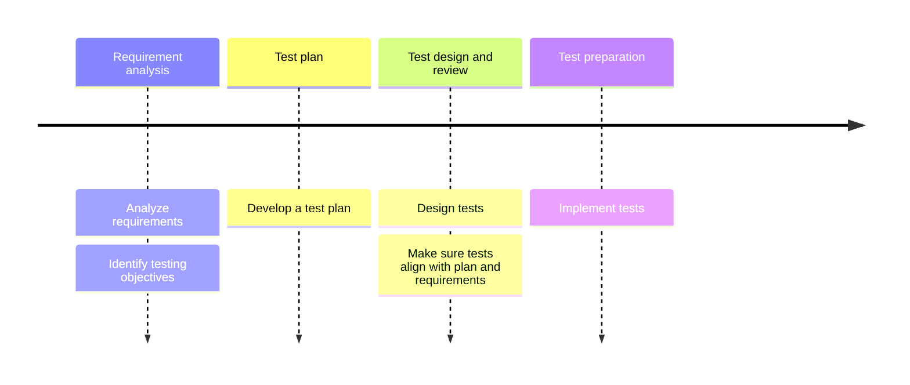

---

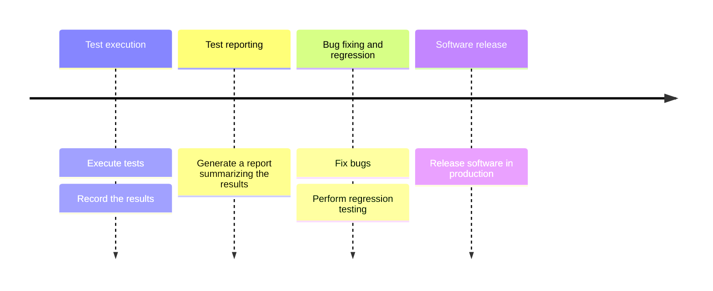

---

Various types of tests may be performed.

| Type             | Meaning                                                                                        |
| ---------------- | ---------------------------------------------------------------------------------------------- |
| Unit test        | Isolated source code (i.e., a component) is tested to validate expected behavior               |
| Integration test | Multiple software components are tested together to verify they work as expected when combined |
| System test      | The complete software system is tested                                                         |

---

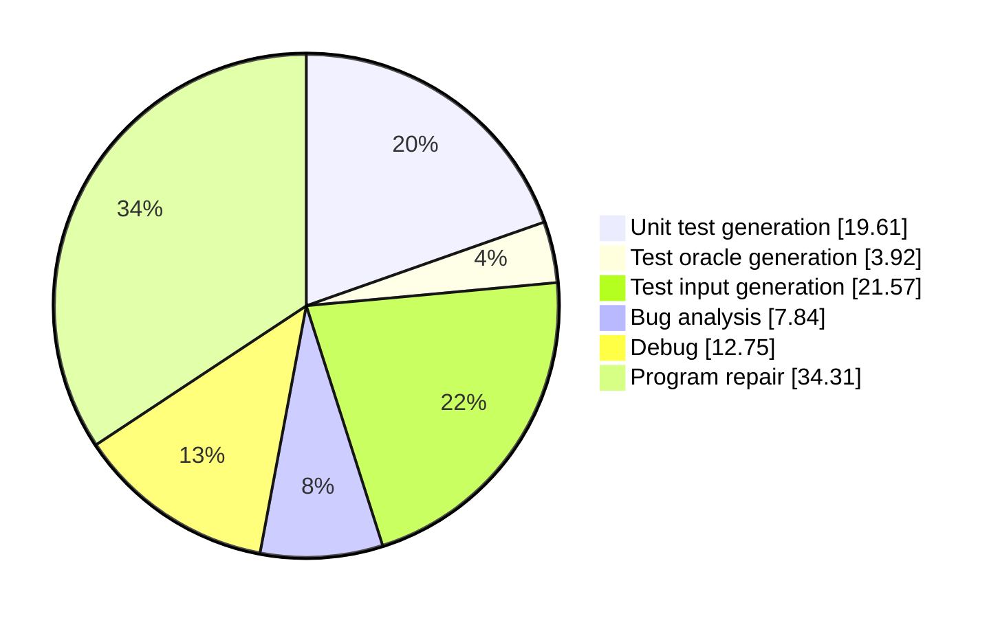

[Software testing with large language models: Survey, landscape, and vision](https://dl.acm.org/doi/10.1109/TSE.2024.3368208)

---

[Wang, J. et al.](https://dl.acm.org/doi/10.1109/TSE.2024.3368208) observed that as LLMs get better, researchers tend to rely on prompt engineering rather than pre-training and/or fine-tuning.

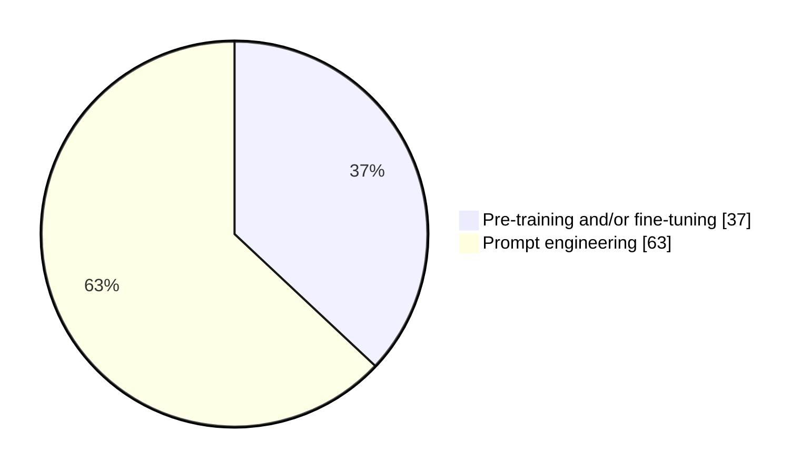

[Software testing with large language models: Survey, landscape, and vision](https://dl.acm.org/doi/10.1109/TSE.2024.3368208)

---

As code generation is generally driven by what is most likely rather than what is most correct, hallucinations threaten correctness.

> A test oracle is a procedure that distinguishes between the correct and incorrect behaviors of the system under test.
> 
> -- [Barr, E. et al.](https://dl.acm.org/doi/10.1109/TSE.2014.2372785)

The lack of a test oracle is particularly relevant when generating brand-new software. This, however, is not always the case. For example, there is a readily-available test oracle when adapting, improving, and developing existing software—the functional behavior of the original system.

---

The oracle problem also plays a role in test generation. A new test either passes or fails on the current release.

Suppose the test passes. We might assume that the functionality is correctly tested and the generated test thus can be used as a regression test against which future changes can be checked. However, a test that passes may merely reflect coincidental correctness or, worse, capture and thereby enforce an incorrect behavior.

Suppose the test fails. This may indicate a bug. However, should it turn out that the ratio of false to true positives is high, then the human oracle cost may make the technique impractical.

### 2.4. Maintenance

#### 2.4.1. Debugging and automated program repair

Debugging is the process of finding the root cause, workarounds, and possible fixes for bugs. LLMs have already proved to work well for fault localization and fault explainability.

Once a bug is found, the programmer is typically responsible to fix it. Automated program repair—the automatic repair of software bugs without the intervention of a human programmer—has been a topic of interest for over a decade in the software engineering research community.

As LLMs are prone to hallucinate, LLM-driven automated program repair is no exception. Scalability is also a main concern when automated repair relies on generate-and-test ([build effort problem](https://dl.acm.org/doi/10.1145/3524459.3527353)).

---

Automated program repair is based on the assumption that program source code changes that occur during development can often be constructed from grafts.

> Changes to a codebase contain snippets that already exist in the codebase at the time of the change, and these snippets can be efficiently found and exploited (the plastic surgery hypothesis).
> 
> -- [Barr, E. et al.](https://dl.acm.org/doi/10.1145/2635868.2635898)

The plastic surgery hypothesis has two parts: changes are repetitive relative to their parent (they showed that changes are 43% graftable on average) and this repetitiveness is usefully exploitable (they found that the parent is by far the most fecund donor and grafts are often contiguous).

#### 2.4.2. Performance improvement

In the 1970s, the strongest concern was about correctness. Software transformation consisted solely of steps that were correct by construction.

In the 2010s, the tight semantic straitjacket of the 1970s was already considerably relaxed to allow transformations that might even fail some tests. The strongest concern became to retain sufficient operational faithfulness. The rationale was that no software can be considered functionally correct when executed on a system in which inefficiency has left insufficient remaining resources.

Today, software generated by LLMs may not even be syntactically correct, let alone semantically. Testing is even more important to assure functional faithfulness and check for regressions in those non-functional properties that are not targeted by the improvement process.

#### 2.4.3. Refactoring

Refactoring is the process of restructuring existing code without changing its external behavior. The objective is to improve non-functional properties (e.g., design) while preserving functionality.

By definition, code refactoring does not change semantics. This means that LLM-based refactoring can rely on the automated regression oracle.

Up to a third of software engineering effort is spent on largely repetitive, tedious, and potentially error-prone refactoring activities. For example, LLMs may help software engineers to refactor existing code to use design patterns, integrate new technologies, or implement project-specific refactoring requirements.

## Glossary

| Term                                       | Meaning                                                                                                                                                                                                                                                                                                |
| ------------------------------------------ | ------------------------------------------------------------------------------------------------------------------------------------------------------------------------------------------------------------------------------------------------------------------------------------------------------ |
| Abstractive summarizer                     | An abstractive summarizer is a type of NLP system that performs document summarization                                                                                                                                                                                                                 |
| Artificial intelligence (AI)               | The capability of computational systems to perform tasks typically associated with human intelligence, such as learning, reasoning, problem-solving, perception, and decision-making                                                                                                                   |
| Automated program repair                   | The automatic repair of software bugs without the intervention of a human programmer                                                                                                                                                                                                                   |
| Bias                                       | A numerical value that shifts the weighted sum of inputs before this sum is fed into the activation function                                                                                                                                                                                           |
| Build effort problem                       | A problem for genetic improvement that occurs when there are many candidates to be evaluated to find an improved version, thereby rendering the technique inapplicable when the build effort is too large                                                                                              |
| Code refactoring                           | The process of restructuring existing source code without changing its external behavior. Refactoring is intended to improve the design, structure, and/or implementation of the software (its non-functional attributes), while preserving its functionality                                          |
| Coincidental correctness                   | A test executes faulty statements yet still produce the expected outputs                                                                                                                                                                                                                               |
| Context inconsistency                      | A type of faithfulness hallucination that occurs when the generated context contradicts the user's provided contextual information                                                                                                                                                                     |
| Debugging                                  | The process of finding the root cause, workarounds, and possible fixes for bugs                                                                                                                                                                                                                        |
| Determinism                                | A model is deterministic if it is not possible for it to react in two or more ways                                                                                                                                                                                                                     |
| Document summarization                     | The task of producing a shorter version of a document while preserving its information content                                                                                                                                                                                                         |
| Entity-error hallucination                 | A type of factual contradiction that occurs when the generated content contains wrong entities                                                                                                                                                                                                         |
| Factual contradiction                      | A type of factuality hallucination that occurs when the generated content contains facts that can be grounded in real-world information but present contradictions                                                                                                                                     |
| Factual fabrication                        | A type of factuality hallucination that occurs when the generated content contains facts that are unverifiable against established real-world knowledge                                                                                                                                                |
| Factuality hallucination                   | A type of hallucination affecting LLMs. This hallucination occurs when there is a discrepancy between the generated content and verifiable real-world facts                                                                                                                                            |
| Faithfulness hallucination                 | A type of hallucination affecting LLMs. This hallucination occurs either when the generated content diverges from user input or when there is a lack of self-consistency in the generated content                                                                                                      |
| Fine-tuning                                | A process by which a model, trained on a large dataset or a related task, is further trained on a smaller or more specific dataset to improve its performance on the target task or domain                                                                                                             |
| Functional requirement                     | A statement that specifies what a system must do                                                                                                                                                                                                                                                       |
| Generative AI (GenAI)                      | A category of AI that focuses on creating new content, such as text, images, audio, and video, based on patterns and data it has been trained on                                                                                                                                                       |
| Graft                                      | A snippet of code located elsewhere in the same program                                                                                                                                                                                                                                                |
| Hallucination (for NLP)                    | A phenomenon in which the generated content appears nonsensical or unfaithful to the provided source content                                                                                                                                                                                           |
| Hallucination (general definition)         | The perception of an entity or an event that is absent in reality                                                                                                                                                                                                                                      |
| Information filtering system               | A system that removes redundant or unwanted information from an information stream using (semi)automated or computerized methods prior to presentation to a human user                                                                                                                                 |
| Instruction inconsistency                  | A type of faithfulness hallucination that occurs when the generated content deviates from the user's directives                                                                                                                                                                                        |
| Large language model (LLM)                 | An AI model that has been trained on large amounts of data and is able to generate text in a human-like fashion                                                                                                                                                                                        |
| Logical inconsistency                      | A type of faithfulness hallucination that occurs when the generated content has internal logic contradictions                                                                                                                                                                                          |
| Natural language processing (NLP)          | A subfield of AI primarily concerned with providing computers with the ability to process data encoded in natural language                                                                                                                                                                             |
| Non-determinism (for LLMs)                 | An LLM may generate different content for the same prompt                                                                                                                                                                                                                                              |
| Non-functional requirement                 | A statement that sets constraints on how the system should operate                                                                                                                                                                                                                                     |
| Overclaim hallucination                    | A type of factual fabrication that occurs when the generated content contains claims that lack universal validity due to subjective biases                                                                                                                                                             |
| Parameter                                  | A numerical value inside an LLM that is adjusted during training. Parameters primarily include weights and biases. The number of parameters is often used as a measure of the size of an LLM                                                                                                           |
| Performance improvement                    | The act of transforming existing software into equivalent software that improves performance while retaining functional behavior                                                                                                                                                                       |
| Plastic surgery                            | The act of grafting existing code to construct changes                                                                                                                                                                                                                                                 |
| Prompt                                     | The input provided to the LLM to stimulate the generation of a response                                                                                                                                                                                                                                |
| Prompt engineering                         | The iterative process of developing a prompt by modifying or changing the prompt engineering technique                                                                                                                                                                                                 |
| Prompt engineering techniques              | A strategy for iterating on a prompt to improve it                                                                                                                                                                                                                                                     |
| Recommender system                         | A subclass of information filtering system that provides suggestions for items that are most pertinent to a particular user                                                                                                                                                                            |
| Regression testing                         | The act of finding software regression after a code change has occurred                                                                                                                                                                                                                                |
| Relation-error hallucination               | A type of factual contradiction that occurs when the generated content contains wrong relations between entities                                                                                                                                                                                       |
| Requirements engineering                   | The process of discovering the purpose for which a software system was intended, by identifying stakeholders and their needs, and documenting these in a form that is amenable to analysis, communication, and subsequent implementation                                                               |
| Requirements traceability                  | The ability to describe and follow the life of a requirement, in both a forwards and backwards direction (i.e., from its origins, through its development and specification, to its subsequent deployment and use, and through all periods of ongoing refinement and iteration in any of these phases) |
| Scaling hypothesis                         | A hypothesis that claims that an AI model's cognitive ability scales with increased compute                                                                                                                                                                                                            |
| Scaling hypothesis (strong interpretation) | As error rates decrease, new cognitive abilities unexpectedly emerge                                                                                                                                                                                                                                   |
| Scaling hypothesis (weak interpretation)   | The model error rates decrease as a power law function of compute                                                                                                                                                                                                                                      |
| Software engineering                       | A branch of both computer science and engineering focused on designing, developing, testing, and maintaining software applications                                                                                                                                                                     |
| Software regression                        | A type of software bug where a feature that has worked before stops working                                                                                                                                                                                                                            |
| Software testing                           | The act of checking whether software satisfies expectations                                                                                                                                                                                                                                            |
| System engineering                         | An interdisciplinary field of engineering and engineering management that focuses on how to design, integrate, and manage complex systems over their life cycles                                                                                                                                       |
| Test oracle                                | A procedure that distinguishes between the correct and incorrect behaviors of the system under test                                                                                                                                                                                                    |
| Token                                      | The atomic unit with which an LLM represents its input and output. Tokens are enumerations. Tokens can represent words, characters, subwords, or other segments of the text and/or code                                                                                                                |
| Unverifiability hallucination              | A type of factual fabrication that occurs when the generated content contains statements that cannot be verified using available sources                                                                                                                                                               |
| Weight                                     | A numerical value that dictates the strength of connections between neurons and serves as coefficient to the input values or activation thresholds for preceding neurons                                                                                                                               |

## Bibliography

| Author         | Title                                                                                                              | Year |
| -------------- | ------------------------------------------------------------------------------------------------------------------ | ---- |
| Community      | [Wikipedia](https://en.wikipedia.org/)                                                                             | 2025 |
| Fan, A. et al. | [Large language models for software engineering: Survey and open problems](https://dl.acm.org/doi/10.1145/3695988) | 2023 |
| Karpathy, A.   | [The busy person's intro to LLMs](https://www.youtube.com/watch?v=zjkBMFhNj_g)                                     | 2024 |

## Licenses

| Content | License                                                                                                                       |
| ------- | ----------------------------------------------------------------------------------------------------------------------------- |
| Code    | [MIT License](https://mit-license.org/)                                                                                       |
| Text    | [Creative Commons Attribution-NonCommercial-ShareAlike 4.0 International](https://creativecommons.org/licenses/by-nc-sa/4.0/) |
