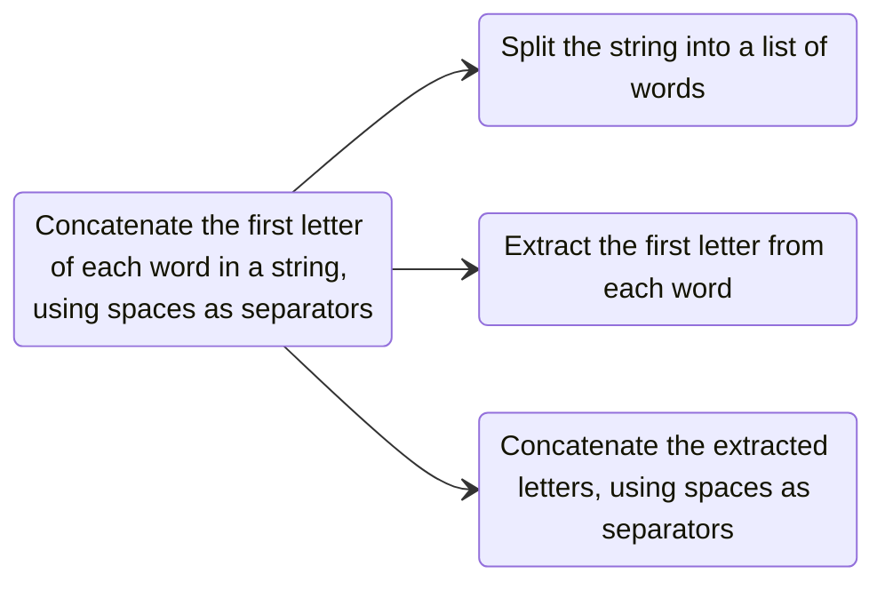
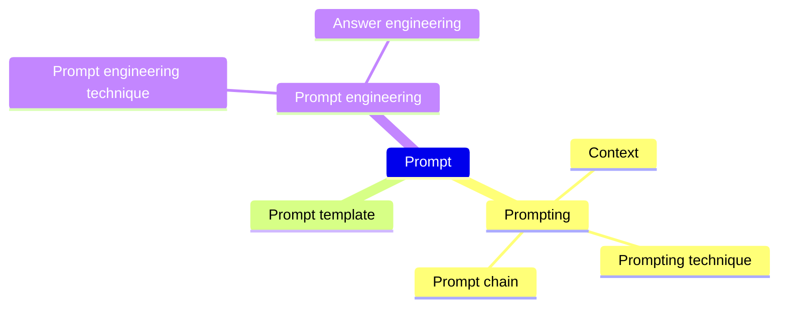
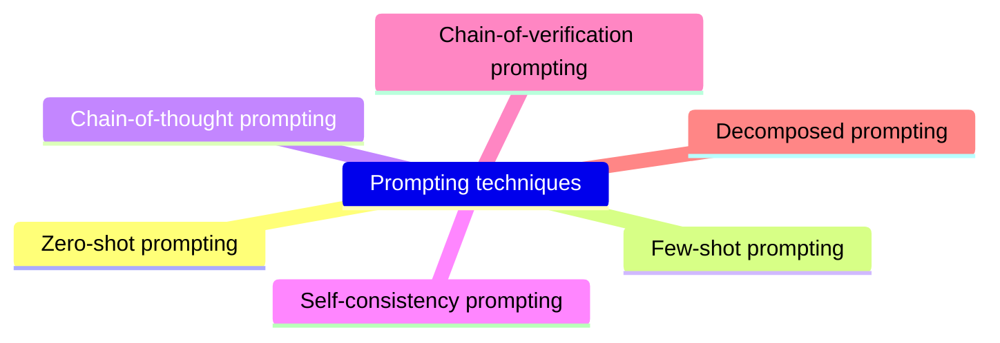

# Prompt engineering

## Table of contents

- [1. Motivation](#1-motivation)
- [2. Prompts](#2-prompts)
    - [2.1. Templates](#21-templates)
    - [2.2. Directives](#22-directives)
    - [2.3. Output formatting](#23-output-formatting)
    - [2.4. Context](#24-context)
- [3. Prompting techniques](#3-prompting-techniques)
    - [3.1. Zero-shot prompting](#31-zero-shot-prompting)
    - [3.2. Few-shot prompting](#32-few-shot-prompting)
    - [3.3. Chain-of-thought prompting](#33-chain-of-thought-prompting)
    - [3.4. Decomposed prompting](#34-decomposed-prompting)
    - [3.5. Self-consistency prompting](#35-self-consistency-prompting)
    - [3.6. Chain-of-verification prompting](#36-chain-of-verification-prompting)
- [4. Prompt engineering techniques](#4-prompt-engineering-techniques)
    - [4.1. Meta prompting](#41-meta-prompting)
- [5. Answer engineering](#5-answer-engineering)
- [6. Parameter tuning for determinism](#6-parameter-tuning-for-determinism)
    - [6.1. Temperature](#61-temperature)
    - [6.2. Top-p](#62-top-p)
    - [6.3. Zeroing temperature and top-p](#63-zeroing-temperature-top-p)
    - [6.4. Seed and system fingerprint](#64-seed-and-system-fingerprint)
- [7. Recap](#7-recap)
- [Glossary](#glossary)
- [Bibliography](#bibliography)
- [Licenses](#licenses)

## 1. Motivation

A prompt is an input to a GenAI model that is used to guide its output. Prompts may consist of text, image, sound, or other media

Empirically, better prompts lead to improved results across a wide range of tasks

However, as prompting is an emerging field, it is still poorly understood, with only a fraction of existing terminologies and techniques being well-known among practitioners

## 2. Prompts

### 2.1. Templates

A prompt template is a function that contains one or more variables which will be replaced by some media (usually text) to create a prompt. This prompt can then be considered as an instance of the template

> [!abstract] Template
> Write a poem about the following topic: `TOPIC`

> [!question] Prompt (template instance, `TOPIC = trees`)
> Write a poem about the following topic: trees

---

A prompt chain consists of two or more prompt templates used in succession. The output of the prompt generated by the first prompt template is used to parametrize the second template, and so on

> [!abstract] Prompt template (1/2)
> Summarize in one sentence: `TEXT`

> [!abstract] Prompt template (2/2)
> Write a headline for: `SUMMARY`

### 2.2. Directives

Many prompts issue a directive in the form of an instruction or question. Directives can be implicit or explicit

> [!question] Prompt (explicit directive)
> Tell me five good books to read

> [!question] Prompt (implicit directive)
> Night: noche
> Morning: 

Examples (aka exemplars or shots) act as demonstrations that guide the GenAI to accomplish a task

### 2.3. Output formatting

It is often desirable that the generated content is in a certain format

> [!abstract] Template
> Summarize the following into a CSV: `PARAGRAPH`

Style instructions are a type of output formatting used to modify the output stylistically rather than structurally

> [!question] Prompt
> Write a clear and curt paragraph about llamas

---

A role, aka a person, is a frequently discussed component that can improve writing and style text

> [!question] Prompt
> I want you to act as a linux terminal. I will type commands and you will reply with what the terminal should show. I want you to only reply with the terminal output inside one unique code block, and nothing else. Do not write explanations. Do not type commands unless I instruct you to do so. When I need to tell you something in English, I will do so by putting text inside curly brackets {like this}. My first command is pwd

https://github.com/f/awesome-chatgpt-prompts

### 2.4. Context

It is often necessary to include additional information in a prompt. This additional information is also called context

> [!question] Prompt (not enough specific)
> Where is Washington?

> [!note] Output
> “Washington” can refer to two different places in the United States—Washington, D.C. and Washington State. Which one are you asking about?

## 3. Prompting techniques

A prompting technique is a blueprint that describes how to structure a prompt, prompts, or dynamic sequencing of multiple prompts. A prompting technique may incorporate conditional logic, parallelism, or other architectural considerations spanning multiple prompts

Think of a prompting technique as a design pattern

Examples of prompting techniques are zero-shot prompting ([§3.1](#31-zero-shot-prompting)), few-shot prompting ([§3.2](#32-few-shot-prompting)), chain-of-thought prompting ([§3.3](#33-chain-of-thought-prompting)), decomposed prompting ([§3.4](#34-decomposed-prompting)), self-consistency prompting ([§3.5](#35-self-consistency-prompting)), and chain-of-verification prompting ([§3.6](#36-chain-of-verification-prompting))

### 3.1. Zero-shot prompting

Zero-shot prompting is a prompting technique that uses zero exemplars. This is the simplest form of prompting. The model has to rely entirely on its pre-trained knowledge to figure out how to complete the task

> [!question] Prompt
> Classify the sentiment of the following text as positive, negative, or neutral.
>  
> Text: I think the vacation was okay. Sentiment:

### 3.2. Few-shot prompting

ICL is the ability of a GenAI to "learn" skills and tasks by providing it with exemplars and/or relevant instructions within the prompt

Few-shot prompting is a prompting technique to generate more desired outputs after first being prompted with a few examples

> [!question] Prompt (exemplars)
> Classify the sentiment of the following text as positive, negative, or neutral.
>  
> Text: The product is terrible. Sentiment: Negative 
> Text: Super helpful, worth it. Sentiment: Positive 
> Text: It doesn't work! Sentiment:

---

| Design decision             | Effect                                                                                                                                                                                                          | Rule of thumb                                |
| --------------------------- | --------------------------------------------------------------------------------------------------------------------------------------------------------------------------------------------------------------- | -------------------------------------------- |
| Exemplar quantity           | Typically, more examples are better ([Brown, T. et al.](https://arxiv.org/abs/2005.14165))                                                                                                                      | Include as many examples as possible         |
| Exemplar ordering           | The order of examples affects model behavior. On some tasks, ordering can cause to vary accuracy from sub-50% to 90%+ ([Lu, Y. et al.](https://arxiv.org/abs/2104.08786))                                       | Randomly order examples                      |
| Exemplar label distribution | The distribution of exemplar labels affects model behavior. More examples of one class can cause the model to be biased toward that class                                                                       | Provide a balanced label distribution        |
| Exemplar label quality      | The necessity of high quality examples is unclear, as some work suggests that providing models with incorrect labels of exemplars may not hurt performance ([Min, S. et al.](https://arxiv.org/abs/2202.12837)) | Ensure examples are labeled correctly        |
| Exemplar format             | The formatting of examples affects performance. The optimal format may vary across tasks                                                                                                                        | Choose a common format                       |
| Exemplar similarity         | Examples that look like the target question work most of the time, but sometimes a mix of diverse examples works even better                                                                                    | Select similar examples to the test instance |

### 3.3. Chain-of-thought prompting

Chain-of-thought prompting is a prompting technique that incorporates logical steps—a “chain of thought”—within the prompt

Traditional prompts (e.g., [zero-shot](#31-zero-shot-prompting) and [few-shot](#32-few-shot-prompting) prompts) typically consist of input-output examples with no explicit reasoning steps

Chain-of-thought prompting guides the model to work through intermediate reasoning steps, making it more adept at solving complex tasks, such as math problems, commonsense reasoning, and symbolic manipulation

[Chain-of-thought prompting elicits reasoning in large language models](https://dl.acm.org/doi/10.5555/3600270.3602070)

---

> [!question] Prompt (few-shot)
> Q: Roger has 5 tennis balls. He buys 2 more cans of tennis balls. Each can has 3 tennis balls. How many tennis balls does he have now?
> A: The answer is 11
> 
> Q: The cafeteria had 23 apples. If they used 20 to make lunch and bought 6 more, how many apples do they have?

> [!fail] Output
> The answer is 27

---

> [!question] Prompt (chain-of-thought)
> Q: Roger has 5 tennis balls. He buys 2 more cans of tennis balls. Each can has 3 tennis balls. How many tennis balls does he have now?
> A: Roger started with 5 balls. 2 cans of 3 tennis balls each is 6 tennis balls. 5 + 6 = 11. The answer is 11
> 
> Q: The cafeteria had 23 apples. If they used 20 to make lunch and bought 6 more, how many apples do they have?

> [!check] Output
> The cafeteria had 23 apples originally. They used 20 to make lunch. So they had 23 - 20 = 3. They bought 6 more apples, so they have 3 + 6 = 9. The answer is 9

### 3.4. Decomposed prompting

Decomposed prompting is a prompting technique that breaks down a complex problem into simpler subtasks. This technique goes a step further than chain-of-thought prompting (see [§3.3](#33-chain-of-thought-prompting)) by explicitly decomposing tasks

The so-called decomposer prompt describes the procedure to solve a complex task using certain subtasks. Each subtask is managed by a dedicated handler, e.g., a few-shot prompt

Using a software engineering analogy, the decomposer prompt defines the top-level program for the complex task using interfaces to simpler subtask functions. The handlers serve as modular, debuggable, and upgradable implementations of these simpler functions, akin to a software library

[Decomposed Prompting: A Modular Approach for Solving Complex Tasks](https://arxiv.org/abs/2210.02406)

---



---

> [!question] Prompt (few-shot)
> `split`: Split a string into a list
> Q: What are the words in `"Elon Musk Tesla"`? A: `["Elon", "Musk", "Tesla"]`
> Q: What are the letters in `"C++"`? A: `["C", "+", "+"]`
> Q: What are the words in `"Hello, world!"`?

> [!note] Output
> The words in `"Hello, world!"` are: `["Hello", "world"]`

---

> [!question] Prompt (few-shot)
> `str_pos`: Find characters at given positions
> Q: What is the first letter of `["E", "l", "o", "n"]`? A: `["E"]`
> Q: What are the second letters of `["Elon", "Musk", "Tesla"]`? A: `["l", "u", "e"]`
> Q: What is the third letter of `["Mattia"]`?
>

> [!note] Output
> The third letter of `["Mattia"]` is: `["t"]`

---

> [!question] Prompt (few-shot)
> `merge`: Concatenate elements in a list into a string  
> Q: Concatenate `["n", "i", "e"]` A: `"nie"`
> Q: Concatenate `["n", "i", "c", "e"]` using spaces A: `"n i c e"`
> Q: Concatenate `["M", "a", "t", "t", "i", "a"]` using spaces

> [!note] Output
> The concatenation of `["M", "a", "t", "t", "i", "a"]` is:  `"M a t t i a"`

---

> [!question] Prompt (decomposed)
> QC: Concatenate the first letter of every word in `"Jack Ryan"` using spaces 
> Q1: `split` What are the words in `"Jack Ryan"`? A1
> Q2: (`foreach`) `str_pos` What is the first letter of A1? A2
> Q3: `merge` Concatenate A2 with spaces

> [!note] Output
> Q1: What are the words in `"Jack Ryan"`?  
> A1: `["Jack", "Ryan"]`
> Q2: What is the first letter of each word in A1?  
> A2: `["J", "R"]`
> Q3: Concatenate A2 with spaces  
> A3: `"J R"`

### 3.5. Self-consistency prompting

Self-consistency prompting is a prompting technique that sends the same prompt multiple times to solve the same problem and takes the majority result as the final answer

This technique is analogous to the human experience that if multiple different ways of thinking lead to the same answer, one has greater confidence that the final answer is correct

Self-consistency leverages the intuition that complex reasoning tasks typically admit multiple reasoning paths that reach a correct answer. As a rule of thumb, the more that deliberate thinking and analysis is required for a problem, the greater the diversity of reasoning paths that can recover the answer

[Self-Consistency Improves Chain of Thought Reasoning in Language Models](https://arxiv.org/abs/2203.11171)

---

>[!question] Prompt (chain-of-thought)
> Q: If there are 3 cars in the parking lot and 2 more cars arrive, how many cars are in the parking lot?
> A: There are 3 cars in the parking lot already. 2 more arrive. Now there are 3 + 2 = 5 cars. The answer is 5
> 
> Q: Janet’s ducks lay 16 eggs per day. She eats three for breakfast every morning and bakes muffins for her friends every day with four. She sells the remainder for $2 per egg. How much does she make every day?

---

> [!check] Output 1
> She has 16 - 3 - 4 = 9 eggs left. So she makes $2 * 9 = $18 per day. The answer is $18

> [!fail] Output 2
> This means she sells the remainder for $2 * (16 - 4 - 3) = $26 per day. The answer is $26

> [!check] Output 3
> She eats 3 for breakfast, so she has 16 - 3 = 13 left. Then she bakes muffins, so she has 13 - 4 = 9 eggs left. So she has 9 eggs * $2 = $18. The answer is $18

### 3.6. Chain-of-verification prompting

Chain-of-verification prompting is a prompting technique that given a baseline response, first plans verification questions to check it, and then systematically answers those questions in order to finally produce an improved revised response

| #   | Step                             | What to do                                                                                                       |
| --- | -------------------------------- | ---------------------------------------------------------------------------------------------------------------- |
| 1   | Generate baseline response       | Prompt the model                                                                                                 |
| 2   | Plan verifications               | Generate a list of verification questions to verify if there are any mistakes in the baseline response           |
| 3   | Execute verifications            | Answer each verification question in turn, and hence check the answer against the baseline response for mistakes |
| 4   | Generate final verified response | Given the mistakes (if any), generate a revised response incorporating the verification results                  |

[Chain-of-Verification Reduces Hallucination in Large Language Models](https://arxiv.org/abs/2309.11495)

---

> [!question] Prompt (chain-of-verification, step 1)
> Name some politicians who were born in NY, New York

> [!note] Output (baseline response)
> Here are a few notable American politicians born in New York City: Donald Trump, Theodore Roosevelt, Hillary Clinton, Bernie Sanders, and Rudolph “Rudy” Giuliani

---

> [!question] Prompt (chain-of-verification, step 2)
> Generate a list of verification questions to verify if there are any mistakes in the previous response

> [!note] Output (verification questions)
> Here are some targeted questions you can ask (or look up) to verify each point in that list:
> 1. Donald Trump: Was Donald Trump born in New York City?
> 2. Theodore Roosevelt: Was Theodore Roosevelt born in New York City?
> 3. Hillary Clinton: Was Hillary Clinton born in New York City?
> 4. Bernie Sanders: Was Bernie Sanders born in New York City?    
> 5. Rudolph “Rudy” Giuliani: Was Rudy Giuliani born in New York City?

---

> [!question] Prompt (chain-of-verification, step 3)
> Answer each question in turn, and hence check the answer against the first response you gave me for mistakes

> [!note] Output (mistakes, if any)
> 1. Donald Trump: Yes
> 2. Theodore Roosevelt: Yes 
> 3. Hillary Clinton: No. Hillary Diane Rodham (Clinton) was born on October 26, 1947, in Chicago, Illinois
> 4. Bernie Sanders: Yes
> 5. Rudolph “Rudy” Giuliani: Yes

---

> [!question] Prompt (chain-of-verification, step 4)
> Given the mistakes (if any), generate a revised response incorporating the verification results

> [!note] Output (improved response)
> In my original list I mistakenly included Hillary Clinton—she was born in Chicago, Illinois, not New York City. Here’s a corrected set of five notable American politicians actually born in New York City: Donald Trump, Theodore Roosevelt, Bernie Sanders, Rudolph “Rudy” Giuliani, and Chuck Schumer

## 4. Prompt engineering techniques

Prompt engineering is the iterative process of developing a prompt by modifying or changing the prompting technique. This can be carried out either manually or automatically
 
A prompt engineering technique is a strategy for iterating on a prompt to improve it

Using a software engineering analogy, a prompting technique is the design pattern that lays out how to structure a prompt (or chain of prompts), while a prompt engineering technique is the debug-and-tune cycle that keeps tweaking that prompt—like refactoring and profiling—until it performs its best

### 4.1. Meta prompting

Meta prompting is a prompt engineering technique that prompts a LLM to generate or improve a prompt or prompt template

This is often done without any scoring mechanism, using just a simple template

> [!abstract] Prompt template (a simple meta prompting template)
> Improve the following prompt: `PROMPT`

---

A meta prompt is an example-agnostic structured prompt designed to capture the reasoning structure of a specific category of tasks. It provides a scaffold that outlines the general approach to a problem, thereby enabling LLMs to fill in task-specific details as needed

A meta prompt focuses on the procedural aspects of problem-solving—the how—rather than the content-specific details—the what

[Meta Prompting for AI Systems](https://arxiv.org/abs/2311.11482)

---

> [!abstract] Prompt template (meta prompt to solve math problems)
> **Problem statement**:
> - Problem: `PROBLEM`
>   
> **Solution structure**:
> 1. Begin the response with "Let’s think step by step"
> 2. Follow with the reasoning steps, ensuring the solution process is broken down clearly and logically
> 3. End the solution with the final answer encapsulated in a LaTeX-formatted box for clarity and emphasis

## 5. Answer engineering

Answer engineering is the iterative process of developing or selecting among algorithms that extract precise answers from LLM outputs

LLMs are probabilistic; in other words, identical inputs can produce different outputs (see [non-determinism](./large-language-models-for-software-engineering.md#142-determinism-v-non-determinism)). This variation in response formats can make the results difficult to parse consistently

| Design decision  | Meaning                              |
| ---------------- | ------------------------------------ |
| Answer shape     | The physical format                  |
| Answer space     | The domain of values                 |
| Answer extractor | The rule to extract the final answer |

---

> [!abstract] Prompt template
> Classify the sentiment of the following text as positive, negative, or neutral: `TEXT`

> [!question] Prompt (template instance, `TEXT = The product is terrible`)
> Classify the sentiment of the following text as positive, negative, or neutral: The product is terrible

---

> [!note] Output 1
> Sentiment: Negative

> [!note] Output 2
> Sentiment: Negative
> 
> The phrase “The product is terrible” clearly expresses dissatisfaction and disapproval, which is characteristic of negative sentiment

> [!note] Output 3
> Sentiment: negative

## 6. Parameter tuning for determinism

Although standard chat interfaces may not offer parameter tuning, this functionality is generally available when you interact with an LLM through an API

1. Install [OpenAI Python API](https://pypi.org/project/openai/)

```shell
$ pip install openai
```

2. Create an [API key](https://platform.openai.com/api-keys)
3. Check [this](../code/openai-api) out

---

Remember that an LLM generates text by choosing one token at a time, based on the probabilities assigned to possible next tokens at each step. At each point in text generation, the model computes a probability distribution over its entire vocabulary, conditioned on the context so far

For example, for the input `The sky is`, it might produce:
- `blue` $\rightarrow$ 0.7
- `clear` $\rightarrow$ 0.2
- `green` $\rightarrow$ 0.05
- all the other tokens with smaller probabilities

### 6.1. Temperature

`temperature` is the parameter that controls the randomness of the generated text ($0 \le$ `temperature` $\le 2$). This parameter scales the probabilities

| Value                     | Effect                                       |
| ------------------------- | -------------------------------------------- |
| $=1$ (default)            | Use original probabilities                   |
| $\lt 1$ (low temperature) | Make the most likely word even more dominant |
| $> 1$ (high temperature)  | Give less likely words a better chance       |

Lower `temperature` values make the model generate more deterministic responses

---

### 6.2 Top-p

`top_p` is the parameter that controls the diversity of word choices in the generated text ($0 \le$ `top_p` $\le 1$). The default value is 1. This parameter filters the token pool

| Value        | Effect                                   |
| ------------ | ---------------------------------------- |
| $\downarrow$ | Set higher constraints on the token pool |
| $\uparrow$   | Consider a broader range of tokens       |

Lower `top_p` values make the model generate more deterministic responses

---

Suppose `top_p` is equal to 0.9. The model sorts all possible tokens by their predicted probability (from highest to lowest) and starts summing their probabilities until the cumulative total reaches or exceeds the threshold (0.9). Only this subset of tokens is retained; the rest are discarded

For example
- `blue` $\rightarrow$ 0.7
- `clear` $\rightarrow$ 0.2 $\leftarrow$ threshold reached
- `green` $\rightarrow$ 0.05
- all the other tokens with smaller probabilities

The model then samples only from the retained set: {`blue`, `clear`}

### 6.3. Zeroing temperature and top-p

`temperature = 0` and `top_p = 0` do not ensure determinism. There are plenty of factors that can still make the model roll the dice

| Factor                 | Meaning                                                                                                                             |
| ---------------------- | ----------------------------------------------------------------------------------------------------------------------------------- |
| Ties happen            | Sometimes two tokens are exactly equally likely                                                                                     |
| Math is done in floats | Probabilities are stored in floating-point numbers. Round-off errors can bump one token a hair above another on different GPUs/CPUs |
| Software updates       | Even a minor library upgrade can reorder the internal token list or change rounding rules                                           |
| Hidden layers          | There are several invisible extra steps between when the model receives the prompt and the user gets the output                     |

### 6.4. Seed and system fingerprint

`seed` is the parameter that makes a best effort to sample deterministically ([OpenAI has recently released this feature in beta](https://platform.openai.com/docs/api-reference/chat/create#chat-create-seed)). However, even with identical `seed` values, small variations can still sneak in

`system_fingerprint` is a response parameter that represents the backend configuration that the model runs with. If the `system_fingerprint` value changes between calls, it means a different backend answered

However, even when `seed` and `system_fingerprint` are the same across API calls, [it is currently not uncommon to still observe a degree of variability in responses](https://learn.microsoft.com/en-us/azure/ai-services/openai/how-to/reproducible-output?tabs=python#output-1)

## 7. Recap



---



## Glossary

| Term                            | Meaning                                                                                                                                                                                                                    |
| ------------------------------- | -------------------------------------------------------------------------------------------------------------------------------------------------------------------------------------------------------------------------- |
| Answer engineering              | The iterative process of developing or selecting among algorithms that extract precise answers from LLM outputs                                                                                                            |
| Artificial intelligence (AI)    | The capability of computational systems to perform tasks typically associated with human intelligence, such as learning, reasoning, problem-solving, perception, and decision-making                                       |
| Chain-of-thought prompting      | A prompting technique that incorporates logical steps—a “chain of thought”—within the prompt                                                                                                                               |
| Chain-of-verification prompting | A prompting technique that given an initial draft response, first plans verification questions to check its work, and then systematically answers those questions in order to finally produce an improved revised response |
| Decomposed prompting            | A prompting technique that breaks down complex problems into simpler subtasks                                                                                                                                              |
| Directive                       | A type of speech act intended to encourage an action                                                                                                                                                                       |
| Example (aka exemplar or shot)  | A demonstration given as part of a prompt to guide the GenAI to accomplish a task                                                                                                                                          |
| Exemplar format                 | The formatting of examples in a prompt. One common format is "question: answer"                                                                                                                                            |
| Exemplar label distribution     | How much of each label to provide in a prompt                                                                                                                                                                              |
| Exemplar label quality          | The quality of examples provided in a prompt                                                                                                                                                                               |
| Exemplar ordering               | The method of ordering the examples in a prompt                                                                                                                                                                            |
| Exemplar quantity               | The amount of examples in a prompt                                                                                                                                                                                         |
| Exemplar similarity             | The degree to which the examples look like the target question                                                                                                                                                             |
| Few-shot prompting              | A prompting technique to generate more desired output after first being prompted with a few examples                                                                                                                       |
| Generative AI (GenAI)           | A category of AI that focuses on creating new content, such as text, images, audio, and video, based on patterns and data it has been trained on                                                                           |
| In-context learning (ICL)       | The ability of a GenAI to learn skills and tasks by providing them with exemplars and/or relevant instructions within the prompt                                                                                           |
| Meta prompt                     | An example-agnostic structured prompt designed<br>to capture the reasoning structure of a specific category of tasks                                                                                                       |
| Meta prompting                  | A prompt engineering technique that prompts a LLM to generate or improve a prompt or prompt template                                                                                                                       |
| Prompt                          | An input to a Generative AI model, that is used to guide its output                                                                                                                                                        |
| Prompt chaining                 | The process of providing to a GenAI two or more templates in succession. The output of the prompt generated by the first prompt template is used to parametrize the second template, and so on                             |
| Prompt engineering              | The iterative process of developing a prompt by modifying or changing the prompting technique                                                                                                                              |
| Prompt engineering technique    | A strategy for iterating on a prompt to improve it                                                                                                                                                                         |
| Prompting                       | The process of providing a prompt to a GenAI, which then generates a response                                                                                                                                              |
| Prompting technique             | A blueprint that describes how to structure a prompt, prompts, or dynamic sequencing of multiple prompts                                                                                                                   |
| Self-consistency prompting      | A prompting technique that sends multiple times the same prompt to solve the same problem and takes the majority result as the final answer                                                                                |
| Style instruction               | A type of output formatting used to modify the output stylistically rather than structurally                                                                                                                               |
| Temperature                     | The parameter that controls the randomness of the generated text                                                                                                                                                           |
| Template                        | A function that contains one or more variables which will be replaced by some media (usually text) to create a prompt                                                                                                      |
| Template instance               | A prompt created by replacing variables in a template                                                                                                                                                                      |
| Token                           | The atomic unit with which an LLM represents its input and output. Tokens are enumerations. Tokens can represent words, characters, subwords, or other segments of the text and/or code                                    |
| Top-p                           | The parameter that controls the diversity of word choices in the generated text                                                                                                                                            |
| Zero-shot prompting             | A prompting technique that uses zero exemplars                                                                                                                                                                             |

## Bibliography

| Author               | Title                                                                                                       | Year |
| -------------------- | ----------------------------------------------------------------------------------------------------------- | ---- |
| Community            | [Wikipedia](https://en.wikipedia.org/)                                                                      | 2025 |
| Schulhoff, S. et al. | [The Prompt Report: A Systematic Survey of Prompt Engineering Techniques](https://arxiv.org/abs/2406.06608) | 2025 |
| Schulhoff, S. et al. | [Learn Prompting](https://learnprompting.org/)                                                              | 2025 |

## Licenses

| Content | License                                                                                                                       |
| ------- | ----------------------------------------------------------------------------------------------------------------------------- |
| Code    | [MIT License](https://mit-license.org/)                                                                                       |
| Text    | [Creative Commons Attribution-NonCommercial-ShareAlike 4.0 International](https://creativecommons.org/licenses/by-nc-sa/4.0/) |
